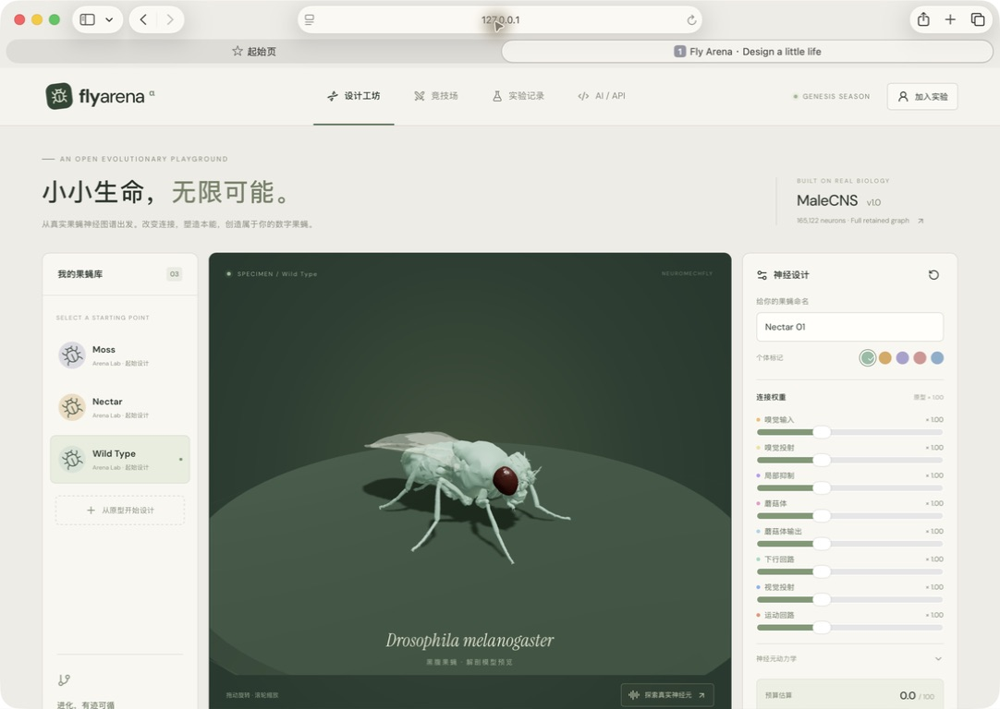

# Fly Arena · Genesis Alpha

用真实果蝇神经图谱，让人和 AI 修改神经网络参数设计数字果蝇，然后在多种竞技环境下 PK。

Implemented research MVP: React/Three.js design workbench, immutable FlySpec compiler, full retained MaleCNS neural simulation, shared-world FlyGym/MuJoCo bodies, asynchronous matches, independent event scoring, anatomical replay, and an agent API. **This is an experimental connectome-constrained game, not a validated reproduction of natural fly intelligence.**

The current graph retains **165,122 Traced neurons, 25,563,197 directed neuron-pair connections, and 124,025,046 synaptic contacts** from MaleCNS v1.0. Anatomical connectivity is real; weights/signs and neural dynamics follow a declared simplified model. Inputs are bilateral odor currents. The shared descending-neuron readout and locomotion controller are engineered and fixed across contestants. Vision, online plasticity, natural aggression, and a GPU neural backend are not implemented.



## Run locally

Requires Python 3.12, Node 22+ and at least 8 GB free memory for preparation and two-fly experiments; allow several GB of disk. Mac Studio is the primary deployment target. Linux CPU also supports the simulation; browser rendering uses the viewer's GPU.

```sh
uv sync --python 3.12
npm ci --prefix web
npm run build --prefix web
uv run arena prepare
uv run arena seed
uv run arena serve --host 127.0.0.1 --port 8080
```

Open http://127.0.0.1:8080. `prepare` downloads the official public MaleCNS files, imports the graph and calibrates a shared readout; it is not an instant startup step. Keep the resulting readout frozen for a deployment. `data/` and `var/` are ignored by Git. The optional `ARENA_DATA` and `ARENA_VAR` environment variables relocate them. See [operations](docs/OPERATIONS.md).

## Use the MVP

1. In **设计工坊**, clone an existing fly, edit circuit weights and intrinsic parameters, validate the budget, and save an immutable design.
2. In **竞技场**, choose an orchard, obstacle garden or sumo ring. Run solo foraging, two-fly food competition, or contact-based ring competition. A paired series exchanges the two spawn slots with identical seeds.
3. Wait for the real simulation worker. Verified matches expose scrub/playback controls, food scores and circuit activity. Failed runs remain visible and do not score.
4. In **AI / API**, export/import FlySpec and obtain your designer token. API documentation is served at `/docs`. The script below publishes a real mutation and evaluates a two-match paired series:

```sh
# Set ARENA_URL and ARENA_TOKEN in your environment; do not commit tokens.
uv run python scripts/ai_designer.py
```

The MVP workspace publishes all designs and verified replays. Default local mode uses a designer bearer token; optional NyxID mode uses browser sessions or separate Arena agent tokens. Optional local registration gating uses `ARENA_INVITE_CODE`. There is a 100-design and 12-pending-match quota per designer. These are beta controls, not a complete production anti-abuse system.

## Architecture and engineering decisions

The trusted path is **FlySpec → validation/compilation → immutable artifact → worker execution → evidence → independent verdict → replay**. Player code never runs inside a match. NyxID is used for node access; Heca/Ornn stay outside physics, neural dynamics and scoring.

Python orchestrates the system; Numba compiles the sparse neural loop to native CPU code; MuJoCo already provides a native physics engine. Start with these measured components, then move verified hotspots to C++20/CUDA if profiling justifies it. Rewriting the full platform in C++ at the outset would not solve the uncertain sensory/motor bridge.

- [Architecture and mechanisms](docs/ARCHITECTURE.md)
- [Research, original sources and prior hardware observations](docs/RESEARCH.md)
- [Acceptance gates and future work](docs/ROADMAP.md)
- [NyxID login interface and later integration](docs/NYXID_LOGIN.md) — optional OIDC + server-side sessions, disabled until configured.
- [Operations and deployment](docs/OPERATIONS.md)
- [Validation evidence and limitations](docs/VALIDATION.md)
- [MVP delivery audit](docs/MVP_ACCEPTANCE.md)
- [Data and software attribution](docs/ATTRIBUTION.md)

```sh
uv run pytest -q
npm run build --prefix web
uv run arena verify var/runs/MATCH_ID/ATTEMPT
```

[PR #1](https://github.com/the-omega-institute/fly-arena/pull/1) remains historical reference. This implementation uses platform-executed connectome mutations rather than arbitrary remote controllers.
