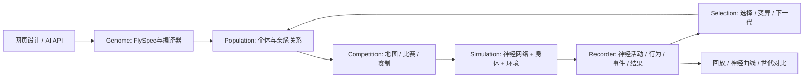

# Fly Arena 架构

## 目标

使用真实果蝇神经图谱，让人和 AI 修改神经参数生成个体，在共同环境中竞争，记录神经活动与行为，并通过选择和变异研究种群演化。

科研对象是数字果蝇在明确模型和环境下的行为，不把游戏分数直接等同于真实动物适应度。

## 一个应用，五个清晰边界

| 边界 | 现在的实现 | 责任 |
| --- | --- | --- |
| Genetics | `contracts.py`, `compiler.py`, `connectome.py` | 不可变基础图谱；有预算的权重和神经参数干预；父代与可复现基因型 |
| Competition | `scenarios.py`, `store.py`, `services/ranking.py` | 场景、资源、赛制、同条件比较与结果聚合 |
| Simulation | `neural.py`, `body.py`, `runner.py` | 神经输入、神经动力学、运动读出、共享 MuJoCo 世界；不依赖账号或外部代理 |
| Research records | `runner.py`, `experiments/`, `services/research_service.py` | 记录真实运行数据，支持回放与对比；失败和缺失数据明确标注 |
| Application | `api.py`, `worker.py`, `web/src/features/` | 身份、提交、异步运行、进度、设计/比赛/演化界面 |

保持模块化单体：FastAPI + SQLite + 一个工作进程 + React/Three.js。工作进程执行整场比赛，不在神经 timestep 中调用网络服务。需要更多吞吐时增加整场任务执行节点；不先建分布式控制平台。

## 一只果蝇与一次实验如何关联

`FlySpec` 保存基础图谱版本、权重变异、神经参数和 `parent_id`。编译后的 artifact 标识有效基因型；不同名字或所有者可以对应相同基因型。Wild Type、官方版本、用户设计是来源身份，不能从名字猜测。

一次比赛绑定参赛个体、场景、赛制、seed、模拟时长和运行版本。记录按模拟时间对齐：

- 神经：回路发放率、选定神经元/群体活动、神经到运动读出；明确采样率和记录范围。
- 行为：位置、朝向、身体姿态、觅食、接触、边界事件、能量。
- 结果：得分、胜负、结束原因和有效性。

回放、神经曲线与统计读取同一场比赛的数据。短期使用已有帧/事件文件与完整神经 checkpoint；需要逐神经元 spike 研究时按实验选择记录，避免默认导出所有时间点的大张量。

## 演化闭环

一个演化实验固定基础图谱、允许变异范围、任务环境、评估种子和选择规则。每一代执行：

1. 保存种群及每只果蝇的亲缘和变异。
2. 在相同地图/seed下安排竞争；成对比赛交换出生位置。
3. 从真实完成的比赛聚合适应度，保留失败和未完成状态。
4. 选择亲本，使用记录的变异 seed 产生下一代，再经过同一编译器和预算检查。
5. 展示谱系、种群多样性、得分变化，以及代表个体的神经活动和行为回放。

手动选择、AI选择与自动选择共用上述数据和 API。先做有限代数、可暂停的实验；没有后台无限自我繁殖。适应度改善和跨环境泛化分开评估，保留 Wild Type 对照。

当前训练沙箱已实现有限预算、自动世代调度、进化与随机搜索、暂停/继续/停止、逐代成绩和亲缘关系、保存后代、分叉训练与结果导出。`services/training.py` 调度普通比赛并保存训练状态；训练评测与公开排行榜分开。用户自己的优化程序在用户设备上运行，通过候选提交 API 参与同一训练会话，平台不执行任意用户代码。可运行示例和接口见 [TRAINING.md](TRAINING.md)。

真实评测已走通本地 API → NyxID → GPU worker 节点 → 回传证据 → 网页回放。外部策略完成四次有限评测并保存了后代；该后代又在稀缺资源地图完成两场换边竞争。可用地图包括果园、障碍花园、最后的绿洲和接触擂台。逐神经元完整 spike 导出、种群多样性指标与比赛内可塑性仍是后续研究功能。

## 技术选择

Python 负责科研表达和应用编排，Numba/NumPy 负责神经计算，MuJoCo 的 C/C++ 实现负责物理。前端 Three.js 显示实际身体姿态。现在不重写全项目为 C++；以实际 profiling 决定是否替换一个计算内核，保持输入/状态/记录接口不变。

configured deployment host 用于应用、CPU 仿真与研究；当前应用可通过 NyxID 将整场比赛交给 GPU worker 主机串行执行。现有负载实测 CPU/Numba 比已实现的有序 CUDA 路径更快，因此当前节点执行使用 CPU。共享任务锁限制重任务并发；重连使用同一个比赛 ID，避免重复计算。节点调度放在整场执行边界，详见 [COMPUTE.md](COMPUTE.md)。

NyxID 只接身份和授权；Ornn 可提供 AI 设计技能；Heca 可管理节点和外层任务。它们不进入神经、物理、评分。现有接口细节见 `NYXID_LOGIN.md`、`CHRONO_REUSE.md`。

从 trureturing 借用清晰领域边界、版本化实验输入、可恢复任务和可观察结果；不复制与当前规模无关的治理流程。工程门槛是清晰代码、有效 CI、及时合并和可运行版本，见 `DEVELOPMENT.md`。
