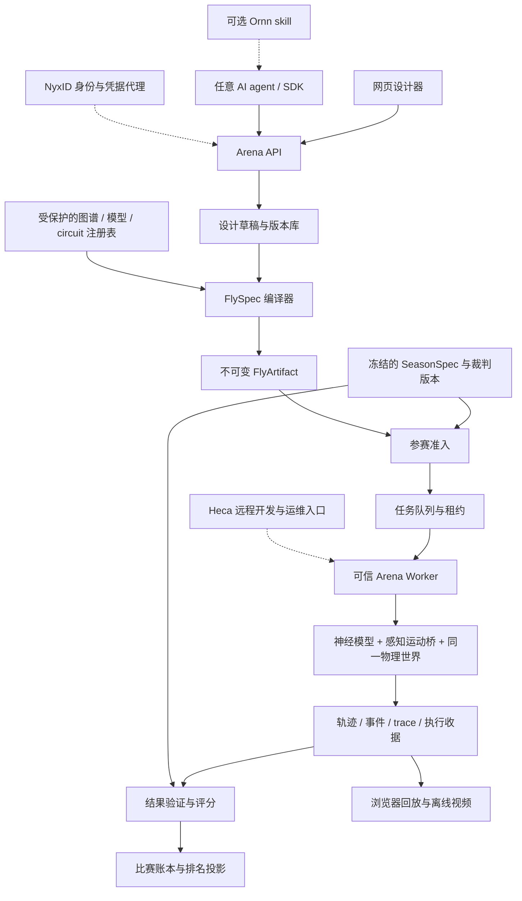

# Fly Arena 架构提案 v0.2

日期：2026-09-16。状态：设计提案；接口、示例标识与数值均不是已上线契约。事实来源和核查边界见 [RESEARCH.md](RESEARCH.md)，实施验收见 [ROADMAP.md](ROADMAP.md)。

## 1. 产品定义与首版范围

**用真实果蝇神经图谱，让人和 AI 修改神经网络参数设计数字果蝇，然后在多种竞技环境下 PK。**

平台的核心资产是可追溯的神经设计及其竞技证据。每只果蝇具有父代、基线图谱、权重改动、神经参数、规则兼容性、实验记录和不可变发布版本。

三个入口汇入同一套编译和验证流程：

| 入口 | 玩家操作 | 产物 |
|---|---|---|
| DESIGN | 网页选择真实 circuit / cell type，调权重和允许的神经参数 | FlySpec 草稿 |
| CODE | 上传 JSON/YAML 和稀疏或完整的边权重增量 | 同一 FlySpec |
| AI | 向任意 agent 描述任务；agent 获取规则、设计、评测、迭代、提交 | 同一 FlySpec，附可选设计说明 |

首个正式赛道固定身体、感官编码、运动读出和低层运动控制器，只开放经过定义的神经网络变异。AI 在赛前设计；正式比赛运行期间不调用外部 LLM、不读取网络、不接受人类操作。PR #1 的远程任意控制器可作为未来 `open-controller` 展示赛道，单独排名。

首版为地面行走果蝇。单蝇趋化与觅食 → 双蝇抢食 → 接触争夺/擂台 → 生存、多蝇与学习赛。飞行、任意形态和自由上传可执行学习程序不进入首版。

## 2. 总体结构



部署上采用**模块化单体控制面 + 独立 worker 进程**。逻辑边界明确，但初期不拆成十几个网络微服务。NyxID、Heca、Ornn 均不进入神经步进、物理积分或裁判函数。

## 3. 真实图谱、模型与身体必须分别版本化

优先建设 `male-cns-v1.0` 导入器，满足使用最新 MaleCNS 的产品目标；同时以 Eon 的 FlyWire v783 模型作为神经动力学和后端对照。二者分别拥有自己的神经元命名空间、筛选规则和基线。不得将 FlyWire 神经元编号直接套到 MaleCNS。

`ConnectomeBundle` 至少包含：

- 原始下载 URL、release、许可证、引用、原始文件 SHA-256。
- neuron table、稳定神经元 ID、cell type、ROI、递质预测及置信度。
- 原始非负突触计数与有向边；定义 `pre -> post` 方向、重复记录聚合方式、自连接及低置信度处理。
- 纳入/排除列表、理由、导入器版本、排序后的 neuron/edge index、派生产物哈希。
- 实际导入的神经元数、有向神经元对数、突触接触总数，三者分别报告。

原始图谱不可变，模型派生层单独计算有效权重。简化模型可写成：

\[
W^0_{ij}=s_{ij}N_{ij}w_0,\quad W_{ij}=W^0_{ij}\exp(\delta_{ij}).
\]

其中 `i` 为 presynaptic、`j` 为 postsynaptic。`N` 是突触数量，`s` 是模型依据递质/受体知识选择的有效符号，`w0` 是模型参数。递质预测不等于所有受体上的确定兴奋/抑制作用；未知和调质神经元必须有显式策略，不可默认全部兴奋。Eon 的 `0.275 mV` 是其 LIF 模型参数，不能宣称是测量得到、可直接移植的 MaleCNS 生物常数。

按 release 和筛选 manifest 区分 full-retained graph 与 circuit subset。早期小子图用于调试时，在 UI 与比赛名称上明确显示。不能把解剖图可视化当作该图已经参与计算的证据。

`ModelProfile` 独立记录动力学方程、积分方式、参数单位、递质策略、初态、输入模型、数值精度与后端。`EmbodimentProfile` 独立记录身体、传感器、感知编码器、输出读出、低层步态控制器、单位和动作限制。三者合起来才是可执行的数字果蝇。

## 4. FlySpec：所有设计入口的共同语言

下面是说明性格式；名称尚未对应已发布 circuit，真实 digest 必须由导入和编译生成。含占位符的示例不能被准入。

```yaml
schema_version: flyspec/v1
name: scarce-food-alpha
parent_artifact: null
base_connectome:
  id: male-cns-v1.0
  manifest_sha256: <resolved-connectome-digest>
model_profile: <approved-lif-profile-digest>
embodiment_profile: <approved-walking-profile-digest>
mutation_policy: <approved-budget-policy-digest>
circuit_catalog: <resolved-circuit-catalog-digest>
weight_mutations:
  - selector_id: <approved-olfactory-edge-group>
    operation: multiply
    scale: 1.15
  - selector_id: <approved-descending-edge-group>
    operation: multiply
    scale: 0.92
edge_delta_artifact: null
neuron_parameters:
  - selector_id: <approved-neuron-group>
    parameter: tau_mem
    operation: multiply
    value: 1.05
  - selector_id: <approved-neuron-group>
    parameter: threshold
    operation: add
    value: 0.5
    unit: mV
plasticity:
  rule: none
```

完整 delta tensor 指**固定 edge index 上的长度 E 的向量**，不是 NxN 稠密矩阵。稀疏增量包含唯一 edge ID 与 log multiplier；未列出的边默认为零增量。文件使用 safetensors 或明确固定 dtype 的数据格式，不接受 pickle、任意 Python、原始 MJCF 或可执行反序列化。

编译顺序必须固定：

1. 严格解析并限制大小、层级、数量与解压后尺寸；拒绝 YAML 自定义 tag、重复键、非有限数值和未知字段。
2. 解析所有版本与 artifact 引用；下载对象只能来自已登记存储，按精确字节校验 digest。
3. 用平台 circuit catalog 将 selector 展开成固定 edge/neuron ID 集合。catalog 保存注释来源、查询、筛选、证据等级和实际 ID 集合哈希。
4. 将全部权重操作转换为 log 增量，重叠 selector 和 tensor 增量按边求和；固定排序和求和精度。拒绝同一 tensor 的重复 edge ID。
5. 从**最终有效增量**统一计算预算、参数范围和稳定性预检，记录详细成本；不按 UI 操作次数收费，也不允许前端自行报告预算。
6. 生成 canonical manifest、数值数组和 `CompileReport`。规范化数值后再生成确定序列化；每个二进制对象按确切字节哈希。
7. 准入服务使用赛季锁定的版本重新验证，发布 `FlyArtifact`。名字、说明、头像与科学身份分离；比赛绑定 artifact digest。

`FlyArtifact` 是编译后的不可变模型参数及其来源 manifest，不含玩家提供的执行代码。网络初态和学习状态按比赛 reset。参赛者修改父代后得到新版本，不覆盖历史。

## 5. 权重变异预算与策略空间

采用 log 空间，强化与削弱都付出成本。首版不返还削弱所得预算，避免反复削弱/恢复刷预算，也避免玩家通过削弱大量低价值边补贴无限强化。

\[
C_W = \sum_{e\in E} c_e|\delta_e|,\qquad
C_W+C_\theta+C_P\le B.
\]

`c_e > 0` 在赛季固定，候选方案为按基线突触数归一化的成本，加每条边的成本下限；这是待实验校准的游戏选择。`B` 不跨不同图谱直接比较。UI 把 `B` 显示为 100 个设计点，只是单位换算。

`C_theta` 对正参数（tau 等）使用相对 log 成本；对可为负的膜阈值使用以 mV 为单位的归一化差值，不能对负阈值取对数。所有可编辑参数要有非零成本、上下界与耦合约束，例如 reset 小于 threshold、tau/refractory 的有效时间范围。不能开放免费的 sensory gain、motor gain、输入噪声或能量常数来绕过预算。

另设不能通过花预算突破的限制：

- ranked 首版不增加边、不改变边符号、不删除 canonical 记录，`m > 0`；完全 silencing 在独立实验配置中开放。
- 每边 multiplier 上下界、每神经元总输入上界、输出动作/关节力矩上界、最大状态/trace 内存和计算预算。
- multiplier 的 `0.5–2.0` 可作预实验区间，但不是已验证平衡参数。所有数值校准后随赛季冻结。
- 游戏中的食物/体力成本与神经设计预算分开。脉冲数量作为能耗代理时标明是游戏模型，不能直接解释为真实代谢。

“攻击 +15%”不能承诺攻击行为提升 15%。首期显示“某已注释回路权重 ×1.15”；完成消融和行为评测后，才提供“偏攻击/偏觅食”预设，并同时展示实际改动、预算与实验区间。

高级阶段可加入平台实现的 `bounded_stdp_v1` 等白名单规则。`C_P` 为可塑边集合、更新幅度和状态规模收费；运行时每个允许的更新时点把权重投影到同一符号、单边界限和**整个总预算可行域**，保留违规/投影计数。投影后的权重才可参与下一步神经计算。规则需固定奖励可见范围、更新频率、trace 状态、数值顺序和计算上限。每局恢复提交时权重；跨局继承只能作为单独“进化赛”协议。

## 6. 神经网络如何真正控制身体

```text
世界状态 x(t)
  → 个体局部传感器 S_i(x)
  → 冻结的感知编码器 E，映射到真实 neuron ID
  → 持续运行的稀疏 LIF 网络，使用玩家 W 与 theta
  → 冻结的神经活动读出 D
  → 公共低层步态 / 关节控制器
  → 有上限的关节驱动
  → 同一个 MuJoCo 世界的下一时刻 x(t+dt)
```

首个闭环建议用双侧气味强度、接触和本体感觉。先实现趋化、转向与觅食，再接复眼/视觉。输入到底进入哪个感觉神经元/投射神经元必须登记，工程化的输入桥不得被描述成完整真实感觉系统。

输出先用冻结的 descending-neuron readout 映射左右驱动和转向。它可以基于文献与校准实验，但应公开映射依据、增益和阈值。低层步态控制器允许工程实现，首版所有玩家共用；不得看到食物坐标后绕过脑模型直接计算转向。任务 reward 只用于评分；只有明确开放学习赛时才通过定义好的通道成为神经输入。

MaleCNS 包含 VNC，不等于所有运动神经元已经和身体肌肉逐一对应。第一版可以运行完整保留图并采用下行读出，但必须披露额外低层控制器，不能声称实现了完整自然神经肌肉控制。

同一比赛的身体必须在同一个 `mjModel/mjData` 世界中，神经状态和 PRNG stream 按 fly 隔离。多个独立单蝇世界叠加渲染不能构成接触竞技。

时间用整数 tick：预实验采用神经和物理基础步 `0.1 ms`、感觉和读出更新周期 `1–10 ms` 进行收敛对照。上游模型的神经 `dt=0.1 ms` 是参考，不表示身体所有场景都适用。冻结后的 `ClockProfile` 保存所有周期的整数比、感知采样点、延迟队列和先后顺序。每轮先采样所有个体、计算所有控制，再统一推进世界，防止 slot 顺序优势。展示帧率不控制仿真时钟。

运行接口约定为 `initialize / reset / advance(k_ticks) / checkpoint / restore / collect_events`。保留膜电位、突触状态、延迟队列、不应期、plasticity traces、控制器内部状态与 PRNG；不能每次动作调用重新初始化脑。Eon 的 standalone benchmark 不能直接视为可逐 tick 插入新感官反馈的闭环 API，需要单独适配验证。

因果验收至少包括：固定输入下基线可重跑、改边导致预期下游活动变化、关闭脑输出后行为显著改变、固定读出下的网络消融、同样预算的随机变异对照，以及环境输入到动作的路径检查。提高胜率与证明真实生物机制分别报告。

## 7. 地图、任务与赛制

三种独立规格组合成比赛，避免每个玩法重新写一个引擎：

| 规格 | 负责 | 示例 |
|---|---|---|
| MapSpec | 静态几何、材质、出生区域、食物源、气味场、遮挡、危险区 | Orchard、Maze、Ring、Islands |
| TaskSpec | 可见信号、资源补充、目标事件、奖励与终止 | forage、resource-contest、territory、survival |
| TournamentSpec | 参赛资格、配对、seed 集、位置交换、积分与晋级 | challenge、league、Swiss、bracket、decathlon |

首批玩法：

| 模式 | 核心取舍 | 权威评分建议 |
|---|---|---|
| 单蝇觅食 | 嗅觉响应、探索、能耗 | 吃到的累计资源；效率作辅助指标 |
| 双蝇抢食 | 先到、抢占、绕行 | 限时内累计摄入的资源量差；相同为平 |
| 擂台争夺 | 接近、推挤、避险 | 离台/占领事件；初期采用碰撞推挤 |
| 生存赛 | 食物、危险、节能 | 生存模拟时长，资源作为预注册 tie-break |
| 隐藏地图多项赛 | 泛化、策略平衡 | 每模式归一化赛季积分，固定权重 |
| 学习赛（后期） | 记忆、可塑性与适应 | 未见任务序列中的适应曲线与累计分数 |

抢食必须基于身体接触或冻结的口器接近条件，不可仅按中心距离任意加分。同 tick 争夺同一资源时先收集请求，再按冻结的公平规则结算；食物总量守恒，不能重复领取。气味扩散首版可用有文档的解析场，若不模拟墙阻挡须披露；不能渲染成密闭迷宫而偷偷提供全局食物方向。

格斗先做可验收的真实接触推挤；HP/攻击技能是后续游戏扩展。伤害由接触、方向、动作窗口和冷却共同决定，同一次 attack_id 对同一目标去重；先收集事件再同时结算。真实果蝇的攻击性或生存能力不能从虚拟 HP 胜率推出。

地图 JSON 是物理与浏览器的共同源。固定毫米、右手坐标系、Z 向上和 wxyz 四元数；Three.js 坐标/四元数和 MuJoCo 半尺寸只在适配层转换。用具名身体 manifest 消除 DOF/segment 索引猜测。地图发布要经过真实身体出生稳定性、重叠、可达性、接触与遮挡检查。

玩家地图先进入自定义练习；官方排名只接纳校准过并冻结的地图/任务。固定公开训练 seed、验证 seed 与保密测试 seed；赛季冻结候选后再运行保密评测。按对手和地图分层，交换出生位置，多 seed 复测，报告样本量和置信区间。循环克制可能存在，因此保留对战矩阵和分模式榜，不只依赖一个 Elo 数。

## 8. 从 trureturing 借鉴的 Arena Harness

借鉴其 trust topology、源绑定报告、FILEMAP custody 和单一命令入口。这里的 harness 是从提交到裁决的可审计执行系统。

| trureturing 的结构思想 | Arena 的落地 |
|---|---|
| 先确定裁判权限，再读候选 | 平台根据请求赛季选择 SeasonSpec 和可信 judge；FlySpec 无权上传裁判 |
| 源码绑定的机器报告 | CompileReport 绑定图谱/增量/编译器；RunReceipt 绑定全部比赛产物 |
| producer 与 admission 分离 | worker 生成轨迹和事件，judge 重算分数并决定是否入榜 |
| FILEMAP 的生产/消费/验证关系 | 每类 artifact 有唯一权威来源、producer、consumer、verifier |
| 生成网页只是 projection | 排名、统计和观战页从已验收账本生成，不直接改“真分数” |
| 受保护程序变更 | 评分、预算、身体、输入/读出与后端变更需新规则版本及回归验收 |
| 工程检查与机器准入分开 | 测试通过、完成运行、裁判验收、写入排名是不同状态 |

不照搬 Lean/.NET 技术栈或整套数学治理层。物理仿真不是 Lean 证明；hash 证明内容一致性，不证明执行正确。trureturing 自身的部署权限与 required checks 也未在本次审计。

平台管理员冻结 `SeasonSpec`：允许的 connectome/model/embodiment/backend、budget policy、地图任务、judge digest、参赛名额和 seed 策略。策略由部署受信任代码决定；候选的“所有测试通过”字段不具准入权限。升级不能回头改变旧局含义；重判产生新的 verdict 和 supersedes 关系，保留旧记录。

建议状态机：

```text
Draft → Compiled → Admitted → Frozen
                              ↓
Requested → Queued → Leased → Running → ArtifactsReady → Verified → Ranked
                        ↘ InfraFailed / SimulationError / Cancelled
            validation failures → Rejected
```

`RunReceipt` 至少含 match/attempt/lease generation、所有 FlyArtifact 和 Map/Task/Season digest、engine commit/build hash、精确依赖/资产版本、硬件/OS/driver/backend/precision、seed/PRNG、clock/solver options、初态/checkpoint、结果事件与回放块清单及 hash、trace 采样策略、墙钟/模拟耗时、峰值内存和失败原因。

验收者核对完整 artifact 清单、连续 tick、最终 tick、资源守恒、合法事件、有限状态、参赛版本和当前 attempt；使用受信任评分器重放事件账本计算得分。只读取 worker 自报的 `winner` 不足以准入。由可信 worker 产生的签名/服务身份收据用于来源认证；管理员控制的 worker 属于信任边界，不声称可以从 hash 远程证明任意恶意主机执行了正确物理。决赛/争议局在第二可信 worker 复跑。

## 9. 数据、API 与任务调度

技术栈建议：React + TypeScript + Vite + Three.js/R3F；FastAPI + Pydantic；PostgreSQL；本地文件 artifact store 起步，保持 S3-compatible 接口。Web/API 与仿真进程独立。浏览器不能直接连接数据库或管理节点。

关系库保存 users/agents、fly_projects、fly_versions、artifact_refs、map_versions、task_versions、seasons、matches、attempts、leases、verdicts、tournament_entries、ratings 和 audit events。大型权重、checkpoint、trace、回放块存对象存储。正式 manifest 内容寻址；私有产物即使 hash 可猜也必须做访问鉴权。

建议外部接口（待实现）：

| Endpoint | 行为 |
|---|---|
| `GET /v1/seasons/{id}` | 返回完整冻结规则和兼容 profile |
| `GET /v1/connectomes/{id}/circuits` | 分页查看注释、edge 集合摘要和来源 |
| `POST /v1/artifacts/uploads` | 申请有限大小、限定类型的上传 |
| `POST /v1/flies/validate` | 解析、预算明细与结构化错误；昂贵检查异步 |
| `POST /v1/flies` | 创建草稿/编译任务 |
| `POST /v1/flies/{id}/versions` | 发布新的不可变版本 |
| `POST /v1/evaluations` | 私有实验，返回 job ID |
| `POST /v1/matches` | 请求练习/公开比赛 |
| `GET /v1/jobs/{id}` | 进度、失败阶段与结果引用 |
| `GET /v1/matches/{id}/replay` | 获取授权回放 manifest |
| `GET /v1/matches/{id}/traces` | 按时间/circuit 查询允许的 trace |
| `POST /v1/tournaments/{id}/entries` | 用 frozen artifact 报名 |

API 提供 OpenAPI、Python/TypeScript SDK 与可选 MCP wrapper；所有写操作有 idempotency key、所有查询执行对象级权限。AI 的请求与人类经过相同验证，quota 按 owner 聚合，不能创建多个 agent 绕过算力配额。

NyxID 负责身份/代理接入；Arena 自己落实 `fly:submit`、`evaluation:run`、`replay:read` 等领域权限、资源所有权与 quota。Ornn 可以分发设计 skill，安装 skill 不授予数据和比赛管理权限。比赛服务的 worker 凭据与用户/agent 凭据独立。

PG 队列用短事务 `FOR UPDATE SKIP LOCKED` 领取、lease TTL 与单调递增 fencing generation；不把事务锁持有整个仿真期间。worker 主动出站领取兼容任务，每场独立进程，初期并发 1。所有上传、完成和 verdict 写入校验 active attempt/generation。旧 worker 迟到、重复回调和重启重试均不能重复入榜。

权重/场景/后端精确匹配才进入同一批处理池。不同玩家拥有不同权重，不能把上游“同一 W 的多 trial batch”当作已经支持；用共享 CSR 拓扑加每个个体独立 values/状态，评测其实际显存。不得为提高吞吐而共享学习状态。

首版进程失败从相同 seed/初态重开，保留失败 attempt；最多自动重试一次，不能反复挑选有利结果。基础设施失败不计玩家竞技输，模型数值失效与非法提交分开；仅在后续明确冻结的资格规则下才对设计失稳做判罚。排名分母和失败率都保留。

## 10. 回放、神经分析与前端

核心页面：`/design` 神经设计工作台、`/flies/:id` 版本谱系、`/lab` 实验比较、`/arenas` 地图和模式、`/matches/:id` 观战回放、`/tournaments` 报名与榜单、`/developers` AI/SDK 文档。

设计器展示预算实时估算、服务端最终预算、变异差异、显式单位与预设实验结果。脑图按 ROI/circuit 聚合和按需加载；不在浏览器同时画几千万条边。性能慢的正式仿真异步排队；浏览器快速预览若采用简化模型，必须标为 preview，不能直接计入排名。

三个不同产物：

- **轨迹回放**：真实 body segment 变换和事件，20–30 Hz 模拟时间采样供浏览器插值；最后一帧和事件可靠保存。
- **仿真 checkpoint**：神经、延迟、控制、物理完整积分状态及 PRNG，用于同环境重跑或未来恢复。
- **神经 trace**：默认 circuit 聚合、选定 neuron 和事件窗口；按权限提供更细 spike 数据，完整全脑日志是有配额的离线分析任务。

网页观众的渲染运行在浏览器 GPU，服务器只推送轨迹。视觉传感器的图像生成属于科学核心输入，必须在 worker 上使用冻结参数执行；它与观众画面分开。高质量视频是比赛后独立 render job，可在 4060 或 Mac 上运行，不阻塞裁判。

播放快照可以忠实重现已记录的轨迹，但不证明另一后端重算出相同结果。相同运行环境争取确定性复现；跨 CPU/CUDA/Metal 用预注册误差和统计指标验证，不能承诺位级一致。正式赛季先冻结单一 backend profile，GPU 内部不确定归约也需实测。

## 11. C++ 从哪一层开始

**建议第一天定义可替换的原生运行接口，第一阶段使用 Python + 现有原生计算后端；不先把网站、harness 和科学模型整体写成 C++。**

| 层 | 首版 | 后续迁移条件 |
|---|---|---|
| Web、API、注册表、调度、评分 | TypeScript / Python / SQL | 没有迁移到 C++ 的既定需求 |
| 数据导入、预算编译、科研分析 | Python + NumPy/SciPy/Arrow | 只有测得独立热点再优化 |
| 神经参考模型 | Brian2 CPU，对照冻结方程；闭环可用经核对的稀疏 CPU 实现 | 保留为正确性对照 |
| NVIDIA 候选后端 | PyTorch sparse 或 GeNN，先验证动态输入与不同权重 batch | 测得步进瓶颈后做 C++/CUDA 内核 |
| 物理 | FlyGym v2.1.0 / MuJoCo 原生引擎的 Python 适配 | Python 高频调用显著占比时将 step loop 原生化 |
| 原生内核 | 设计 C ABI/批量 buffer 契约 | `libflycore` 用 C++20，pybind11 仅在边界绑定 |
| Apple GPU | 首版 CPU 可运行 | 仅在 sparse 算子/性能测定后评估 Metal，不能假设 CUDA 可用 |

原生接口只接受已经验证的 manifest 与固定布局数组：CSR topology、每个体 weights、神经状态、输入和事件 buffer。`advance(k_ticks)` 在原生侧推进多个 tick，避免 Python 每边或每神经元循环；不在 neural tick 路径进行 HTTP/JSON/磁盘写入。

C++20/CMake/pinned toolchain 足够。结构采用稀疏数组与 structure-of-arrays，不给每条突触创建对象。拓扑只读共享，个体参数和状态隔离；GPU 端保留循环状态，控制 host/device 传输频率。PyTorch/GeNN 已经调用原生内核，额外手写 C++ 不必然更快。

启动自研的建议门槛：目标负载未达标，profile 显示可迁移部分占墙钟显著比例（预设参考 30%），已有可重跑 fixture，原型带来至少约 2 倍该部分加速且数值/任务对照通过。门槛是工程决策初值，不是性能承诺。若测量发现主要瓶颈在视觉渲染或接触求解，就优先处理该处。

## 12. 资源部署与容量

已核实 Mac Studio：M3 Ultra、96 GiB 内存、28 CPU 核，Heca daemon 运行且 relay connected。4060 节点在线发现，但显存和软件栈未核实；详见研究记录。

| 资源 | 初期角色 | 注意事项 |
|---|---|---|
| Mac Studio | 导入、CPU 神经参考、单场物理、可信本地 worker、开发阶段 API/PG | 原生 macOS CPU 路径；统一内存不等于 CUDA 显存 |
| 4060 | 待接入后的 CUDA 单场/小 batch、视觉渲染、离线视频 | 不按名称假定显存或 WSL/Linux 版本 |
| 未来小型公网主机 | Web/API、数据库或托管 DB、队列入口、artifact 存储 | 暂未发现/部署；公众可用性不依赖家庭节点在线 |
| 观众浏览器 | 3D 回放、脑区可视化 | 不消费服务器每观众一份视频渲染资源 |

Heca 是远程开发和诊断入口，不承担比赛调度。生产 worker 建立自己的出站连接；关闭 Heca 后依然完成已领比赛。NyxID 是身份与凭据层，不承担神经网络计算。无需为初版引入 Kubernetes、Ray 集群或专门向量数据库。

按 `N` 神经元和 `E` 有向边计算稀疏内存。共享 CSR 可用约 `4E + 4(N+1)` bytes 存 32 位索引，加至少 `4E` bytes/个体的 float32 权重；索引范围超出时升级。若还保存 delta、plasticity 状态或优化器状态，额外逐项累加，不能把文件大小当运行内存。假设 E=25M，仅一份 float32 edge 数组约 100 MB；这是公式示例，不是本次导入测量。

`N=165k` 的 NxN float32 稠密矩阵约 109 GB（十进制），所以架构禁止默认稠密化。实际容量同时包含身体、视觉帧、编译 workspace、spike/延迟缓冲、多个玩家权重及内存碎片。

基准必须报告真实时间倍率 `RTF = simulated_seconds / wall_seconds`、冷启动/编译、纯神经步进、物理/控制、传感、I/O、峰值 RAM/VRAM、每场成本和数值失效率。先测 1 场，再测 2/4 场；双蝇一世界与两场单蝇任务分别报告。未有实测前不承诺实时、并发量或完整赛季成本。

## 13. 工程目录建议

以下为未来布局，不表示这些实现已经存在：

```text
apps/web/                    # DESIGN / LAB / ARENA / replay
services/api/                # 平台领域接口与权限
services/worker/             # lease、进程隔离、artifact 上传
packages/contracts/         # FlySpec / MapSpec / SeasonSpec / Receipt schema
packages/connectome/        # 导入器、ID 映射、图谱 manifest
packages/compiler/          # selector 展开、delta、budget
packages/neural/            # 神经模型与 backend adapters
packages/embodiment/        # 感知编码、读出、FlyGym 适配
packages/arena/             # 世界、资源和权威事件
packages/judge/             # 版本化准入与评分
packages/sdk/               # Python / TypeScript 客户端
native/flycore/             # 达到测量门槛后实现的 C++ 核心
registry/                   # 受保护的版本 manifest 和 circuit catalog
scenarios/                  # 声明式地图、任务、赛制
experiments/                # 实验定义、待执行状态和证据引用
tools/harness/              # validate / run / verify / compare / benchmark
tests/                      # 契约、数值、故障与因果验收
docs/                       # ADR、研究、运维与来源
```

将 `contracts` 作为最小依赖底座，禁止 `neural/arena/judge` 导入 NyxID、Ornn、Heca、Web 或 HTTP 框架；依赖方向用架构检查约束。harness 统一入口建议为 `arena validate / compile / run / verify / compare / benchmark`，既供开发也供 AI 使用；这些命令尚待实现。
