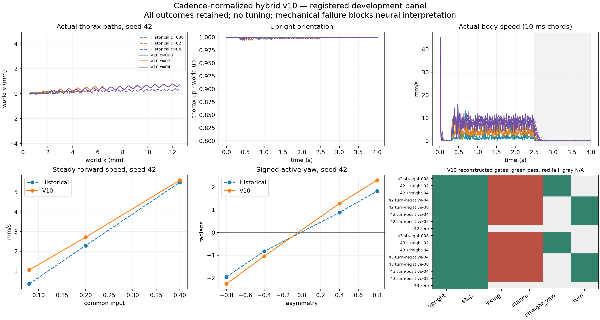

# V10 scientific result: implemented, development commissioning failed

Candidate: `cadence-normalized-hybrid-v10`, based on integrated reviewed source `064fa96bc5438986b9aa7aa4f92354484a5cd7b2`. One candidate, no sweeps, no post-outcome coefficient, seed, threshold, or segmentation changes. The experiment used its frozen archived source; the later runner finalization correction below has not been physically qualified. This is an honest failed scientific result with useful measured improvements; it does not qualify normal walking or fulfill the original usable phenotype-comparison goal.

The entire fixed development panel completed: historical and candidate controllers × seeds 42/43 × eight four-second conditions, totaling **32 trials and 128 physical seconds**. All initialized raw records and every gate failure remain available. No numerical exception or resource cap stopped the panel. A separate verifier process reconstructed the complete panel from raw records and reproduced the decision exactly.

**Untouched evaluation seeds 31042/31043, the full-trial repeat, all full-network trials, the separate 15-predicate evaluator, phenotype comparisons, output ablations, and candidate Lab/API/replay admission were skipped because development failed. Full-network simulation time is zero.** Historical 15-gate qualification and interpretation were not weakened or relabeled. No production toggle was added.

## What passed and what failed

All 16 candidate conditions passed finite-state, upright, and final-stop gates. Both seeds passed the registered three-speed ordering and increments. All six candidate straight conditions passed the steady yaw-rate bound, and all eight turn conditions had the required yaw sign and magnitude. The bounded real-physics restoration test passed; active controller/RNG restoration also passed its separate contract fixture. The untouched exact-repeat gate was not run.

All 14 nonzero candidate conditions failed both the registered swing and stance gates. These have distinct meanings:

- **Swing:** among 30,820 registered complete contact-free bouts, 17,532 had no 1 ms geometry sample and failed conservatively. Of the 13,288 sampled bouts, 12,926 had peak lowest whole-foot collision-mesh clearance at or below 0.02 mm. Short contact chatter contributes many bouts, but the failure is not solely a sampling artifact: well-sampled hind-foot episodes also fail by a large margin.
- **Stance:** among 27,857 complete contact bouts, 16,289 had no 1 ms geometry sample and therefore failed the preregistered rule. Of the sampled bouts, 10,788 had exactly one geometry sample: their computed zero displacement compares that sample with itself and is not proof of no slip. Every sampled stance displacement was below 0.15 mm; the maximum was 0.0366065092 mm. The result does **not** establish excessive measured slip or exclude motion between samples. Full stance qualification is unavailable under this registered contact/geometry sampling combination. The original registered stance decisions remain unchanged.
- **Concrete clearance counterexamples:** candidate seed 42, straight common 0.2, left hind ticks 7207–7727 (52.1 ms) peaked at 0.0009683863 mm; right hind ticks 8619–9199 (58.1 ms) peaked at 0.0009940726 mm. Both complete contact-free episodes are much longer than the 1 ms geometry interval, and both fail the required 0.02 mm. The native meshes and actual per-time transforms, not tarsus-origin height, establish these values.

No thresholds or contact definitions were relaxed after seeing these failures. The raw 10 kHz qpos/control/contact data are retained; deriving a different contact segmentation or sampling-based admission afterward would be a different analysis and cannot retroactively qualify this registered panel.

## Measured controller authority

Forward speed uses the registered steady window 0.6–2.5 s and the actual per-time thorax forward axis. Values are mm/s.

| Seed | Common input | Historical | V10 |
| --- | ---: | ---: | ---: |
| 42 | 0.08 | 0.346665 | 1.052307 |
| 42 | 0.2 | 2.287971 | 2.711329 |
| 42 | 0.4 | 5.490933 | 5.602282 |
| 43 | 0.08 | 0.390402 | 1.122043 |
| 43 | 0.2 | 2.361994 | 2.774696 |
| 43 | 0.4 | 5.541161 | 5.681540 |

Across candidate conditions, minimum upright z was **0.9774105973** (required >0.8). Maximum absolute steady straight yaw rate was **0.0591098586 rad/s** (required <0.15). Final-second mean speed and endpoint displacement were at most **6.95765332e-7 mm/s** and **6.95765331e-7 mm**, respectively (required <0.1 mm/s and <0.25 mm). Maximum native position-actuator force magnitude was **42.4099671**, below the native bound 65; recorded position-force saturation fraction was zero. Native generalized force/torque units are retained without an unsupported SI or muscle conversion.

The baseline failed stop in eight conditions under the same final-second speed criterion, although net displacement was small. Its nonzero conditions also failed the new swing/stance panel. Those baseline results neither waive candidate failures nor reinterpret historical v4 qualification.

Cadence normalization and full command/state holding improve low-drive translation and stopping in this development panel. They retain near-ground hind-tarsal motion and do not establish the required complete clear swings. This localizes a remaining engineered gait limitation; it does not prove anatomical impossibility, invalidate canonical connectome data, or demonstrate a neural-design phenotype effect.

## Complete development outcomes

Yaw is net active-window yaw in radians. Stop speed is the final-second 10 kHz 3D chord mean in mm/s. “Swing, stance” include the sampling failures described above; they do not mean excessive measured stance displacement. Zero conditions are exempt from locomotor cycle/speed/turn requirements.

| Controller | Seed | Case | Forward mm/s | Active yaw rad | Min upright | Stop mm/s | Failed per-trial gates |
| --- | ---: | --- | ---: | ---: | ---: | ---: | --- |
| Historical | 42 | zero | -0.000426 | 0.001538 | 0.999302 | 0.279763 | stop |
| Historical | 42 | straight-008 | 0.346665 | -0.000063 | 0.998344 | 0.0629545 | stance, swing |
| Historical | 42 | straight-02 | 2.287971 | 0.001013 | 0.997916 | 0.0534479 | stance, swing |
| Historical | 42 | straight-04 | 5.490933 | -0.011695 | 0.996889 | 0.120246 | stance, stop, swing |
| Historical | 42 | turn-negative-04 | 2.344688 | -0.826406 | 0.998260 | 0.0585047 | stance, swing |
| Historical | 42 | turn-positive-04 | 2.374216 | 0.884087 | 0.997197 | 0.0591837 | stance, swing |
| Historical | 42 | turn-negative-08 | 2.211835 | -1.947634 | 0.997625 | 0.118634 | stance, stop, swing |
| Historical | 42 | turn-positive-08 | 2.438694 | 1.824089 | 0.994873 | 0.170132 | stance, stop, swing |
| Historical | 43 | zero | 0.000102 | -0.000353 | 0.998285 | 0.112604 | stop |
| Historical | 43 | straight-008 | 0.390402 | 0.033527 | 0.998285 | 0.069019 | stance, swing |
| Historical | 43 | straight-02 | 2.361994 | 0.025339 | 0.997885 | 0.0545424 | stance, swing |
| Historical | 43 | straight-04 | 5.541161 | 0.023869 | 0.995847 | 0.125592 | stance, stop, swing |
| Historical | 43 | turn-negative-04 | 2.430288 | -0.828761 | 0.998285 | 0.0588473 | stance, swing |
| Historical | 43 | turn-positive-04 | 2.510862 | 0.825363 | 0.996707 | 0.0587784 | stance, swing |
| Historical | 43 | turn-negative-08 | 2.292666 | -1.959968 | 0.997643 | 0.171817 | stance, stop, swing |
| Historical | 43 | turn-positive-08 | 2.376092 | 1.953051 | 0.996413 | 0.184257 | stance, stop, swing |
| V10 | 42 | zero | -0.000000 | -0.000000 | 0.999392 | 3.35178e-08 | none |
| V10 | 42 | straight-008 | 1.052307 | 0.114949 | 0.993882 | 1.56196e-08 | stance, swing |
| V10 | 42 | straight-02 | 2.711329 | 0.123092 | 0.993173 | 3.97231e-11 | stance, swing |
| V10 | 42 | straight-04 | 5.602282 | 0.112961 | 0.993315 | 8.55689e-09 | stance, swing |
| V10 | 42 | turn-negative-04 | 2.635486 | -1.044096 | 0.990780 | 6.34305e-08 | stance, swing |
| V10 | 42 | turn-positive-04 | 2.642904 | 1.275253 | 0.987508 | 8.27415e-10 | stance, swing |
| V10 | 42 | turn-negative-08 | 2.365674 | -2.255344 | 0.981062 | 6.03923e-07 | stance, swing |
| V10 | 42 | turn-positive-08 | 2.696135 | 2.301911 | 0.977411 | 6.11458e-07 | stance, swing |
| V10 | 43 | zero | 0.000000 | -0.000001 | 0.997463 | 6.95765e-07 | none |
| V10 | 43 | straight-008 | 1.122043 | -0.060463 | 0.988779 | 2.91917e-10 | stance, swing |
| V10 | 43 | straight-02 | 2.774696 | 0.032809 | 0.989006 | 1.60987e-09 | stance, swing |
| V10 | 43 | straight-04 | 5.681540 | -0.039222 | 0.991848 | 8.43183e-11 | stance, swing |
| V10 | 43 | turn-negative-04 | 2.713580 | -1.149336 | 0.992110 | 3.82363e-09 | stance, swing |
| V10 | 43 | turn-positive-04 | 2.773201 | 1.299064 | 0.987831 | 2.8842e-10 | stance, swing |
| V10 | 43 | turn-negative-08 | 2.481358 | -2.388908 | 0.993916 | 2.74464e-07 | stance, swing |
| V10 | 43 | turn-positive-08 | 2.477660 | 2.510496 | 0.985351 | 3.22887e-09 | stance, swing |

## Evidence, tests, and reproducibility

- Experiment root: `var/behavior-v10/mechanical-01`. The immutable registration includes the approved plan, exact equations and units, native DOFs/transmissions/model arrays, all seeds/timings/metrics/gates, source archive, graph/weight references, and original subject identities.
- Retained scientific grids: 1,280,032 core rows at 10 kHz and 128,032 geometry rows at 1 kHz, including each initial state. The bounded restoration comparison reuses scheduled trial ticks and adds no physical seconds.
- Independent decision: `var/behavior-v10/independent-verification-01/decision.json`. The separate verifier reread all raw archives, validated complete condition panels and waveforms, reconstructed geometry from native qpos, and reproduced all decisions exactly.
- Contract tests: **20 passed** (13 v10/controller/evidence/actuator/native-geometry cases and 7 unchanged-v4 motor cases); JUnit is `var/behavior-v10/contract-tests-01/junit.xml`. Tests cover complete phase scaling with unchanged amplitude convergence, silence including adhesion/RNG/counters, active controller continuation, invalid input without mutation, native 42-axis geometry/actuator mapping and single right-axis conversion, initialized prefixes, primary failures, failed optional snapshots, emergency prefix retention and fixed numeric archive fields. Fixtures are not physical qualification.
- Real physical restoration is deliberately bounded to the common silent prefix of candidate seed 42 zero/straight-008: cached full MuJoCo state and complete controller state were restored after deliberate destination corruption, and all core, geometry, and integration arrays matched for ticks 1001–1100. This does not claim arbitrary active physical checkpoint portability.
- The static plot below was generated from retained raw records and inspected with `view_image`. It uses 10 ms chords for its displayed speed curve; the gate calculation uses the registered 0.1 ms intervals. Legend suffixes 008/02/04 refer to registered common drives 0.08/0.2/0.4.

Frozen identities:

- Registration SHA-256: `05eb10e60c7ad19ce7de04012d4d67a8e0042a60f7ed006f388e65caab7d94ec`.
- Source manifest SHA-256: `dbd234ea75e699ed907688be43df30e4bd3accd3cdfaaecb1ec648e0b0d148d2` (286 archived files).
- Compiled model SHA-256: `c84909b93a562b21c045466499187b964af92530c88ac9e627867a689d7819d2`.
- Original subject-reference SHA-256: `4cee64e069a48102182ba4e5efcd095a4de2a176ed3a469f3200ef57f614d248`.
- Reconstructed development decision SHA-256: `91ed4a4b31e858aff3e28690d899344336b3cac126ceb6d301619d6515b69787`.

The three original WT/official/submitted subject IDs, owners, and artifacts are preserved verbatim in the registration. They were not physically compared through the full neural graph in this failed candidate. Existing identity/Chrono integration ports were not expanded or activated. The intended usable same-condition phenotype comparison and qualified Lab/API integration remain unmet.

## Resource use

The experiment process, including its first raw reconstruction, used 1494.180 s wall time, 1468.372 s user CPU, 25.362 s system CPU, and 632,160,256 bytes peak RSS. It recorded 2,473,879,414 bytes before the separate verification/plot/report artifacts. The independent verification took 25.360 s wall time with 625,491,968 bytes peak RSS. Setup, contract tests, and report generation are outside the experiment-process wall timer. All activity remained within the 8-hour wall budget; one CPU simulation worker, 128/260 mechanical seconds, 0/259 full-network seconds, no sweeps, no GPU, no installs, and no service/authentication/publication changes. Final evidence size and file hashes are recorded in `var/behavior-v10/evidence-index.json`.

The bounded post-review correction changes only runner finalization/fail-stop handling and reporting. Synthetic regressions exercise incomplete streams, finish exceptions, resource reporting failures, and combined physical/finalization failures. Original evidence and source snapshots remain immutable; the old experiment was run by the archived source in the original workspace's `var/delivery/behavior-v10/registered-development.tar` (SHA-256 `36b3a3a49814840500c3229718bb7b9ca060c56a47da924f68c1273ebbc7bb53`). Correction receipts are separate in `var/behavior-v10-correction`. No new physical or neural trials qualify the corrected runner, and no original source hashes are assigned to it.

The restoration validator's missing explicit continuation-array shape checks and trial-stream binding remain a separate advisory. Historical bounded restoration does not support future positive admission until those checks are addressed. This repair does not change that validator or any registered scientific decision.

Reconstruct the retained panel without physics with the existing virtual-environment Python, target `src` on `PYTHONPATH`, and `python -m flyarena.experiments.verify_v10 var/behavior-v10/mechanical-01 --stage development --output /tmp/fly-v10-correction/independent-decision.json`. Keep caches under `/tmp/fly-v10-correction`. Reproducing the historical computation requires its archived source and matching dependencies. A future run of current source requires separate authorization, a new source freeze, and a fresh exclusive directory as documented in `BEHAVIOR_V10.md`; it cannot inherit the historical receipts.
