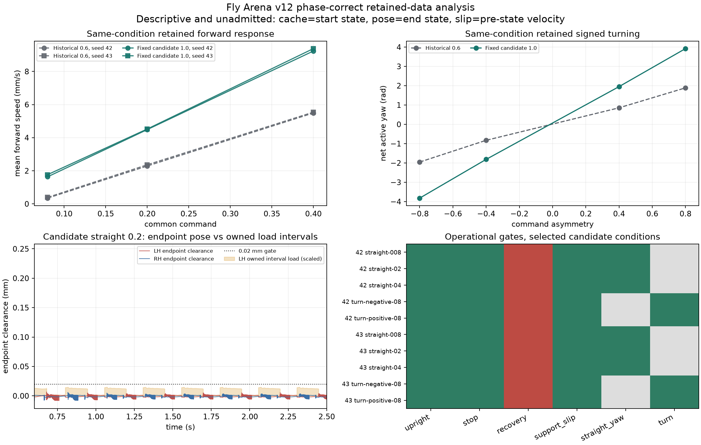

# Behavior v12 paired-state correction addendum

Verdict: the observer/arithmetic/provenance correction is implemented and independently verified, but the retained candidate does not pass the operational walking gates. This is a separately versioned read-only analysis, not a retroactive regrade of the historical v12 run. Held-out seeds, neural15, Wild Type/official/user phenotypes, ablations, Lab/API/replay, and product admission remain unrun and blocked.

## Corrected phase ownership

For every `k>=1`, raw contact/frame/wrench row `k` owns interval `((k-1)dt,kdt]`. Its cached geometry belongs to `core[k-1].qpos`. Coherent material velocity for the registered slip calculation is `J(core[k-1].qpos) @ core[k-1].qvel`; the historically saved velocity is retained only as the explicitly labeled hybrid diagnostic `J(core[k-1].qpos) @ core[k].qvel`. Physical endpoint pose and AP come from `core[k].qpos`; endpoint `k` independently matches next cache row `k+1` where that row exists. Tick zero is initialization and contributes no force or slip quadrature.

All reconstruction arithmetic casts frozen mesh vertices to float64 before the mean. The unchanged strict tolerance is `5e-12`. Across all 32 trials, cache-to-start geometry error was `0.0` mm, endpoint-to-next-cache error was `0.0` mm, saved-hybrid velocity error was `1.5631940186722204e-13` mm/s, and independent pre-state object/Jacobian error was `1.7053025658242404e-13` mm/s.

The earlier report's claim that the approximately `6e-9 mm` residual was an MJB serialization floor was unsupported and is superseded by this addendum. Frozen compiled arrays and the MJB-loaded arrays match exactly. The nonzero residual came from averaging float32 mesh vertices before conversion to float64, while the recorder converted before averaging. The historical report, figure, raw streams, failed decision, registration, source archive, and index remain byte-identical.

## Retained-data result

The correction derived `32/32` trials and `9095759` raw contact rows. Whole-index closure checked 12,338 files and 3,217,398,285 bytes. Invalid interior phase episodes: `0`; legitimate analysis-window boundary partials remain separately recorded per leg and trial. Every derived trial retains unfiltered endpoint AP, whole-foot clearance, owned interval force, pre-state slip numerator, source row identities, ties, reversals, partials, and failures.

Candidate operational result: `fail`. Failed complete candidate swings by leg across nonzero development conditions were: LF `12`, LM `15`, LH `106`, RF `14`, RM `16`, RH `104`. These are operational gate results under the unchanged policy. In particular, an inside leg remaining loaded during a strong turn can describe an anchored/pivoting strategy; the turn gate is not by itself a biological naturalness claim. Straight-condition hind-foot failures are independent of that interpretive ambiguity.

## Verification and boundaries

The detached paired-state fixture used `2` integrations and `0.0002` physical seconds. It proved start-cache ownership, pre-state velocity, detection of wrong same-row and hybrid pairings, positive loaded contact, and bitwise trajectory/cache noninterference. The strengthened restoration receipt joined expected and replayed ticks 10001..10100 exactly to the corresponding retained core, dense, and contact rows; identity substitutions reject before comparison and the verifier has no live state to mutate.

Independent verification sampled `12832` endpoint reconstructions and `91240` pre-state contact velocities, while closing all normal forces directly from raw contacts. It passed at the same `5e-12` tolerance. Tests: `14` passed, `0` failed, with JUnit SHA-256 `8b9ce5d0b39c0d9ab47d82a66e8ac4847b5d33dcdd974cca6815ed7e4b2215a8`.

Analysis resources: `632.0144283749978` s wall, `618.398316` s user CPU, `9.801968` s system CPU, `622231552` bytes peak RSS, and `258563780` bytes of new registered output at analysis completion. One CPU worker, no network, no long physics, no full-network run. Total tiny-fixture physics across the recorded implementation commands was `0.0068` s.

The existing `ArtifactRepository`, `ResearchRepository`, `IdentityProvider`, `ExperimentExecutor`, `LocalProbeExecutor`, `ConditionSpec`, and `PhenotypeReport` ports remain unchanged. No new platform surface or candidate exposure was introduced. The remaining goal gap is actual qualified walking followed by the unchanged held-out, neural15, same-condition WT/official/user phenotype, ablation, and product path.

## Receipts

- Correction registration SHA-256: `d100688fabf8c86c88c701a2750c3973ebc037ae71a40113c65a8f2d8b290625`
- Analysis SHA-256: `bc061cbe5862cd3c725f5b9ca985fb137073026d1cfd718fbd0806ec68ade276`
- Independent verification SHA-256: `76eeeba4627de308b229d7f8b3e7d97604e1d4310a6909c0869f8f4ac2664117`
- Raw closure SHA-256: `13972aa2b2caeb6179c9d149b164aa570bcbad458f410925b3911c4526e0c99d`
- Plot SHA-256: `4cc1d9df49c1e443e0b9ab31dd15c45f68e8f2ed948e1e7541312cd71089a0b4`
- Plot producer SHA-256: `e093b1e08f4bcdcece2d8205f63dde06a42a0754227f21dcb9fe4dbd3c646635`
- Original immutable evidence index SHA-256: `2feab6649e24a2b8d3dde616cdfd4ef0db13d723bd1b232aa7d631ecb7aeae1f`
- Original durable archive SHA-256 binding: `b9f5921112812e23f7f581bbc24c776178946e9148bba10cba2e2f5830b53bf8`
