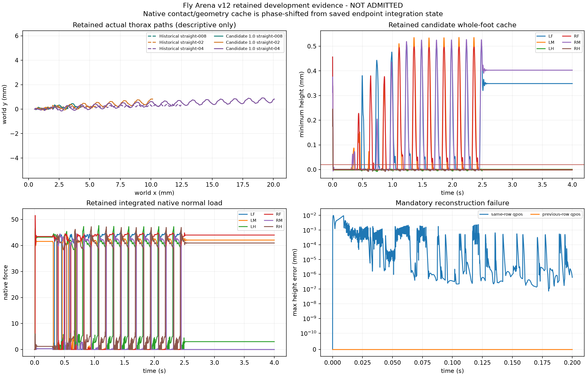

# Source-native excursion v12 result

Verdict: experiment executed and evidence retained, but scientific admission failed.
The candidate is not qualified walking behavior and does not complete the user,
Wild Type, and official-design phenotype comparison goal. No held-out, neural,
phenotype, Lab, API, replay, service, Git, or remote stage ran.

## Frozen candidate and timing

The single candidate changed only the nominal active trajectory amplitude from
`0.6` to `1.0`. Frequency and coupling retained `c/0.6` scaling, convergence
remained `20/s`, and the installed anatomy, passive/root freedom, reflexes,
adhesion, axes, transmissions, force limits, waveform, conditions, and thresholds
were unchanged. Turning targets up to `1.8` were registered as experimental.

The exact registered observer convention was: row 0 followed initialization;
row `k>0` was sampled immediately after the `k`th `mj_step`; its integration state,
live geometry/contact cache, `mj_contactForce`, and Jacobian velocity were assumed
to describe one endpoint and interval `(k-1,k]`. There were no extra observer
forwards, warm-start edits, or hidden integration steps. The centered median was
exactly 31 samples (`tick-15..tick+15`) wholly inside one complete commanded swing,
with no padding. PEP was the earliest exact global filtered minimum and AEP the
earliest later occurrence of that swing's exact global maximum. Command episodes
were strict installed swing-state runs bounded within ticks `6000..25000`.

That native timing assumption failed mandatory reconstruction. On all 40,001 rows
of the first retained trial, same-row geometry differed by up to
`0.04240888218321692 mm` (mean row maximum `0.00010701932701722661 mm`). Across
3,192 sampled saved contacts, same-row point velocity differed by up to
`0.5822652710893834 mm/s`. Replacing same-row qpos with previous-row qpos only in a
read-only diagnostic reduced sampled contact-velocity error to exactly `0.0` and
geometry error to at most `6.346009495672433e-9 mm`. This demonstrates that the
live solver/contact/geometry cache is phase-shifted from the advanced integration
state. It also exposes an MJB reconstruction floor above the frozen `5e-12`
geometry tolerance. The registered force-relative slip and recovery joins are
therefore not admissible, and no post-outcome offset or tolerance change was made.

## Execution and retention

- Development: historical plus candidate, seeds 42/43, all eight conditions,
  `32/32` complete trial terminals and `128.00 s` scheduled physics.
- Active branch: candidate straight `0.2`, seed 42 checkpoint at tick 10000;
  seed-43 destination completed its scheduled trial, was corrupted, restored, and
  replayed through ticks 10001..10100. All raw physics/controller/cache/contact/
  geometry comparisons passed bitwise. Exactly `0.01 s` was added.
- Total physics: `128.01 s`; full-network physics: `0 s`; one CPU worker.
- Resources: `1765.9169776659692 s` wall, `1709.471514 s` user CPU,
  `60.379046 s` system CPU, `541245440` bytes peak RSS, and `3216879456` bytes at
  the execution resource receipt.
- Raw retention: `9,095,759` native foot-ground contact rows, complete dense core
  and whole-foot/cache streams for all trials, `12,334` experiment files at final
  diagnostic count, and no retention failures.
- Tests: `408 passed, 10 skipped` with the exact interpreter and canonical
  read-only data root. Focused contracts covered candidate equations, silence and
  invalid-input atomicity, native contact-point Jacobians, strict active binding,
  destination corruption/restoration, bitwise continuation, and three-stream
  failure finalization.

The static figure below shows retained descriptive paths, whole-foot cache values,
native loads, and the alignment failure. Those traces are not gait admission or a
retrospective gate decision.

## Receipts and boundaries

- Registration SHA-256:
  `7cc7e1c9a01c51584355d463724ef2dcc83ba8fc141bd1aaf202f8d22b9644ce`
- Frozen source manifest SHA-256:
  `042e235397282cf87e972551e53aefa6b32628c21a3a26a4d8f1ffa312d4a894`
- Execution terminal SHA-256:
  `221f15ba625abad2bc65279ae58ceb589c3500863a6d42b1be8c32869a0debaa`
- Restoration result SHA-256:
  `59eabfff2ba71a05c30fc04bc81e9f3981ef5f17d3037ad1678c994f542043fa`
- Expected and actual restoration NPZ SHA-256:
  `f86178d7050f7f4519f1aa775be74428ee8b6b33eb80e7426f588b80e82aa1cd`
- Full-suite JUnit SHA-256:
  `bd932c9f2b217e3c6b0040bb5c927e72fd511a61a60d2a35d90061f8347be9ce`

The existing Chrono reuse assessment and narrow `ArtifactRepository`,
`ResearchRepository`, `IdentityProvider`, `ExperimentExecutor`,
`LocalProbeExecutor`, `ConditionSpec`, and `PhenotypeReport` boundaries remain the
integration ports. The approved plan explicitly required no new Chrono surface.
Because development admission failed, none of those ports was used to expose this
candidate and existing product admission remains unchanged.

The remaining gap is not another amplitude choice. A future separately approved
experiment would first need a source-native capture point or explicit paired
pre/post state schema that binds each integrated force/contact cache to the exact
qpos/qvel phase used for geometry and material velocity, with a preregistered MJB
numeric tolerance. This v12 result cannot select that repair or authorize a rerun.
