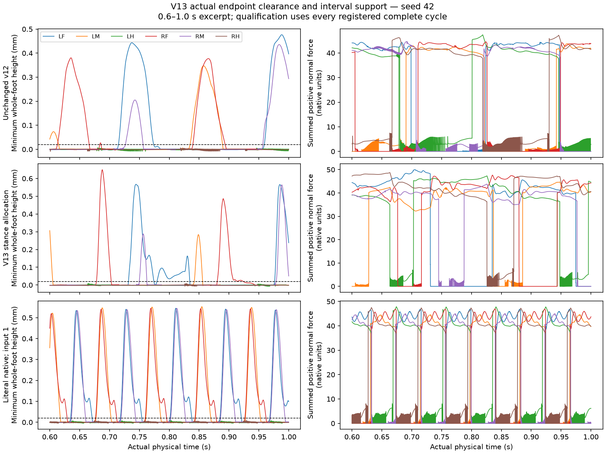

# V13 native swing / slow stance mechanical experiment

Development candidate passed: **False**. Independent numerical verification passed: **True**.

One prospectively fixed controller changed only per-leg phase speed. Native body, trajectory, amplitude convergence, reflexes, adhesion, bounds and gates were preserved. Literal native references use input 1 and continue controller evolution during zero input; their results are not presumed positive.

| Profile | Seed | Case | Speed mm/s | Yaw rad | Recovery | Support/slip | Stop | Failed gates |
|---|---:|---|---:|---:|---|---|---|---|
| literal-native-reference | 42 | native-nominal | 14.417052 | 0.053038 | False | True | False | recovery, stop |
| literal-native-reference | 43 | native-nominal | 14.426293 | 0.057731 | False | True | False | recovery, stop |
| native-swing-slow-stance-v13 | 42 | straight-008 | 1.189834 | 0.013735 | False | True | True | recovery |
| native-swing-slow-stance-v13 | 42 | straight-02 | 3.458561 | 0.005612 | False | True | True | recovery |
| native-swing-slow-stance-v13 | 42 | straight-04 | 8.369257 | 0.152109 | False | True | True | recovery |
| native-swing-slow-stance-v13 | 42 | turn-negative-04 | 3.128855 | -1.394109 | False | True | True | recovery |
| native-swing-slow-stance-v13 | 42 | turn-negative-08 | 2.882794 | -3.642493 | False | False | True | recovery, support_slip |
| native-swing-slow-stance-v13 | 42 | turn-positive-04 | 3.162924 | 1.520501 | False | True | True | recovery |
| native-swing-slow-stance-v13 | 42 | turn-positive-08 | 3.161895 | 2.815181 | False | True | True | recovery |
| native-swing-slow-stance-v13 | 42 | zero | -0.000000 | -0.000000 | exempt | exempt | True | none |
| native-swing-slow-stance-v13 | 43 | straight-008 | 1.129633 | 0.170729 | False | True | True | recovery |
| native-swing-slow-stance-v13 | 43 | straight-02 | 3.496173 | -0.056478 | False | True | True | recovery |
| native-swing-slow-stance-v13 | 43 | straight-04 | 8.519192 | -0.083155 | False | True | True | recovery |
| native-swing-slow-stance-v13 | 43 | turn-negative-04 | 3.162798 | -1.140611 | False | True | True | recovery |
| native-swing-slow-stance-v13 | 43 | turn-negative-08 | 3.077458 | -3.017273 | False | True | True | recovery |
| native-swing-slow-stance-v13 | 43 | turn-positive-04 | 3.285303 | 1.100412 | False | True | True | recovery |
| native-swing-slow-stance-v13 | 43 | turn-positive-08 | 3.131083 | 3.062919 | False | False | True | recovery, support_slip |
| native-swing-slow-stance-v13 | 43 | zero | 0.000000 | -0.000001 | exempt | exempt | True | none |
| source-native-excursion-v12 | 42 | straight-008 | 1.634308 | 0.178227 | False | True | True | recovery |
| source-native-excursion-v12 | 42 | straight-02 | 4.489568 | 0.138201 | False | True | True | recovery |
| source-native-excursion-v12 | 42 | straight-04 | 9.235346 | 0.143974 | False | True | True | recovery |
| source-native-excursion-v12 | 42 | turn-negative-04 | 4.297822 | -1.783511 | False | True | True | recovery |
| source-native-excursion-v12 | 42 | turn-negative-08 | 3.753231 | -3.820860 | False | True | True | recovery |
| source-native-excursion-v12 | 42 | turn-positive-04 | 4.289780 | 1.944419 | False | True | True | recovery |
| source-native-excursion-v12 | 42 | turn-positive-08 | 4.206158 | 3.814404 | False | True | True | recovery |
| source-native-excursion-v12 | 42 | zero | -0.000000 | -0.000000 | exempt | exempt | True | none |
| source-native-excursion-v12 | 43 | straight-008 | 1.764400 | -0.072040 | False | True | True | recovery |
| source-native-excursion-v12 | 43 | straight-02 | 4.522977 | 0.070276 | False | True | True | recovery |
| source-native-excursion-v12 | 43 | straight-04 | 9.380119 | -0.037450 | False | True | True | recovery |
| source-native-excursion-v12 | 43 | turn-negative-04 | 4.448802 | -1.847724 | False | True | True | recovery |
| source-native-excursion-v12 | 43 | turn-negative-08 | 4.046483 | -3.823773 | False | True | True | recovery |
| source-native-excursion-v12 | 43 | turn-positive-04 | 4.479920 | 1.959699 | False | True | True | recovery |
| source-native-excursion-v12 | 43 | turn-positive-08 | 4.008411 | 4.027672 | False | True | True | recovery |
| source-native-excursion-v12 | 43 | zero | 0.000000 | -0.000001 | exempt | exempt | True | none |

## Speed dose gates

- native-swing-slow-stance-v13--42--speed-dose: True
- native-swing-slow-stance-v13--43--speed-dose: True
- source-native-excursion-v12--42--speed-dose: True
- source-native-excursion-v12--43--speed-dose: True

## Evidence and limits

Actual physical seconds: 136.0. Full network seconds: 0. Peak RSS: 1792409600 bytes. Runtime: 2927.46 seconds.
Registration SHA-256: `407dac972e9754387c3176ef65df1c45935fdc6b1c51e085d973f65924562c5b`.
Actual nonphysical tests: 16 passing cases; JUnit SHA-256 `2e801f80fd19ebc43bd114c8dd8afc6a0c1ea00062c7f41242c6ecd2df4aa0e4`.

Raw force/cache rows retain their prestate ownership; corrected endpoints use q[k], and every coherent contact velocity uses J(q[k-1])v[k-1]. Tick zero contributes no quadrature. Every complete swing/stance, ambiguity, reversal, tie, boundary partial, passive state and joint tracking measurement is retained.

Development failure blocks held-out, repeat, restoration, neural, phenotype and product admission. This experiment does not establish coordinated walking unless all frozen gates and later qualification pass. No coefficient was selected from its outcome.

Actual walking remains the first unresolved goal, followed by the unchanged original neural 15 predicates, matched Wild Type/official/user phenotype panels and causal ablations, then clear design identity and actual-state Lab/API/replay integration.

