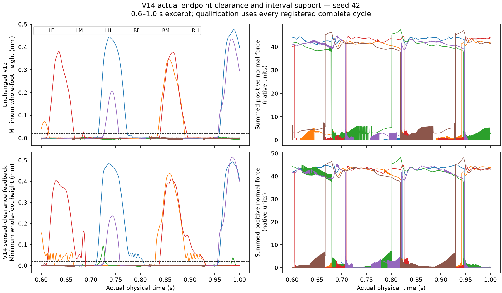

# V14 whole-foot retraction feedback mechanical experiment

Development candidate passed: **False**. Independent numerical verification passed: **True**.

One prospectively fixed controller replaced the native single-leg relative-height retraction selector with independent deficient-swing whole-foot triggers. Native retraction rates, persistence, correction vectors, phase envelope, body, v12 timing/excursion, adhesion, bounds and gates were preserved. The .05 mm sensed setpoint is an engineered trigger; actual recovery still requires the unchanged >.02 mm unloaded protraction gate.

| Profile | Seed | Case | Speed mm/s | Yaw rad | Recovery | Support/slip | Stop | Failed gates |
|---|---:|---|---:|---:|---|---|---|---|
| source-native-excursion-v12 | 42 | straight-008 | 1.634308 | 0.178227 | False | True | True | recovery |
| source-native-excursion-v12 | 42 | straight-02 | 4.489568 | 0.138201 | False | True | True | recovery |
| source-native-excursion-v12 | 42 | straight-04 | 9.235346 | 0.143974 | False | True | True | recovery |
| source-native-excursion-v12 | 42 | turn-negative-04 | 4.297822 | -1.783511 | False | True | True | recovery |
| source-native-excursion-v12 | 42 | turn-negative-08 | 3.753231 | -3.820860 | False | True | True | recovery |
| source-native-excursion-v12 | 42 | turn-positive-04 | 4.289780 | 1.944419 | False | True | True | recovery |
| source-native-excursion-v12 | 42 | turn-positive-08 | 4.206158 | 3.814404 | False | True | True | recovery |
| source-native-excursion-v12 | 42 | zero | -0.000000 | -0.000000 | exempt | exempt | True | none |
| source-native-excursion-v12 | 43 | straight-008 | 1.764400 | -0.072040 | False | True | True | recovery |
| source-native-excursion-v12 | 43 | straight-02 | 4.522977 | 0.070276 | False | True | True | recovery |
| source-native-excursion-v12 | 43 | straight-04 | 9.380119 | -0.037450 | False | True | True | recovery |
| source-native-excursion-v12 | 43 | turn-negative-04 | 4.448802 | -1.847724 | False | True | True | recovery |
| source-native-excursion-v12 | 43 | turn-negative-08 | 4.046483 | -3.823773 | False | True | True | recovery |
| source-native-excursion-v12 | 43 | turn-positive-04 | 4.479920 | 1.959699 | False | True | True | recovery |
| source-native-excursion-v12 | 43 | turn-positive-08 | 4.008411 | 4.027672 | False | True | True | recovery |
| source-native-excursion-v12 | 43 | zero | 0.000000 | -0.000001 | exempt | exempt | True | none |
| whole-foot-retraction-feedback-v14 | 42 | straight-008 | 1.671427 | 0.211422 | False | True | True | recovery |
| whole-foot-retraction-feedback-v14 | 42 | straight-02 | 4.544402 | 0.171987 | False | True | True | recovery |
| whole-foot-retraction-feedback-v14 | 42 | straight-04 | 9.375098 | 0.203616 | False | True | True | recovery |
| whole-foot-retraction-feedback-v14 | 42 | turn-negative-04 | 4.380377 | -0.970100 | False | True | True | recovery |
| whole-foot-retraction-feedback-v14 | 42 | turn-negative-08 | 4.011417 | -2.774953 | False | True | True | recovery |
| whole-foot-retraction-feedback-v14 | 42 | turn-positive-04 | 4.490874 | 1.256450 | False | False | True | recovery, support_slip |
| whole-foot-retraction-feedback-v14 | 42 | turn-positive-08 | 4.519611 | 3.104263 | False | True | True | recovery |
| whole-foot-retraction-feedback-v14 | 42 | zero | -0.000000 | -0.000000 | exempt | exempt | True | none |
| whole-foot-retraction-feedback-v14 | 43 | straight-008 | 1.792833 | 0.002741 | False | False | True | recovery, support_slip |
| whole-foot-retraction-feedback-v14 | 43 | straight-02 | 4.534173 | 0.103297 | False | True | True | recovery |
| whole-foot-retraction-feedback-v14 | 43 | straight-04 | 9.498126 | -0.061418 | False | True | True | recovery |
| whole-foot-retraction-feedback-v14 | 43 | turn-negative-04 | 4.576074 | -1.051272 | False | True | True | recovery |
| whole-foot-retraction-feedback-v14 | 43 | turn-negative-08 | 4.329837 | -2.890948 | False | True | True | recovery |
| whole-foot-retraction-feedback-v14 | 43 | turn-positive-04 | 4.523230 | 1.063458 | False | True | True | recovery |
| whole-foot-retraction-feedback-v14 | 43 | turn-positive-08 | 4.379700 | 3.028882 | False | True | True | recovery |
| whole-foot-retraction-feedback-v14 | 43 | zero | 0.000000 | -0.000001 | exempt | exempt | True | none |

## Feedback and limits

Candidate trigger counts and raw retraction maxima by leg (LF, LM, LH, RF, RM, RH):

- whole-foot-retraction-feedback-v14--42--straight-008: triggers [3406, 5209, 6267, 3608, 6557, 7595]; raw maxima [52.13999999999924, 73.52999999999841, 150.82000000000056, 90.26999999999843, 203.68000000000944, 165.4300000000031]; raw scalar >80 active ticks [0, 0, 5208, 275, 5565, 5373].
- whole-foot-retraction-feedback-v14--42--straight-02: triggers [3300, 3545, 8946, 3418, 4616, 9294]; raw maxima [25.549999999999816, 49.29999999999923, 91.63999999999832, 40.95999999999948, 82.2399999999986, 105.9999999999981]; raw scalar >80 active ticks [0, 0, 925, 0, 59, 1522].
- whole-foot-retraction-feedback-v14--42--straight-04: triggers [2948, 3861, 9383, 3027, 4525, 9757]; raw maxima [16.639999999999997, 32.96999999999964, 53.27999999999922, 22.07999999999988, 42.55999999999945, 54.0799999999992]; raw scalar >80 active ticks [0, 0, 0, 0, 0, 0].
- whole-foot-retraction-feedback-v14--42--turn-negative-04: triggers [1583, 3226, 9650, 6329, 7859, 8428]; raw maxima [19.789999999999925, 52.71999999999923, 106.34999999999808, 47.909999999999314, 77.57999999999882, 86.65999999999835]; raw scalar >80 active ticks [0, 0, 2496, 0, 0, 197].
- whole-foot-retraction-feedback-v14--42--turn-negative-08: triggers [1417, 3794, 9773, 7648, 9952, 7861]; raw maxima [15.659999999999979, 49.4399999999993, 109.11999999999803, 70.64999999999854, 140.04000000001636, 68.79999999999878]; raw scalar >80 active ticks [0, 0, 2512, 0, 7144, 0].
- whole-foot-retraction-feedback-v14--42--turn-positive-04: triggers [6119, 6038, 8227, 1771, 4194, 9678]; raw maxima [46.849999999999326, 46.71999999999931, 92.36999999999813, 42.79999999999944, 64.43999999999879, 102.0499999999981]; raw scalar >80 active ticks [0, 0, 367, 0, 0, 2280].
- whole-foot-retraction-feedback-v14--42--turn-positive-08: triggers [7354, 6435, 7601, 2063, 4769, 9785]; raw maxima [66.8999999999988, 44.589999999999314, 69.5499999999988, 46.07999999999937, 67.9999999999989, 88.63999999999847]; raw scalar >80 active ticks [0, 0, 0, 0, 0, 1274].
- whole-foot-retraction-feedback-v14--42--zero: triggers [0, 0, 0, 0, 0, 0]; raw maxima [0.0, 0.0, 0.0, 0.0, 0.0, 0.0]; raw scalar >80 active ticks [0, 0, 0, 0, 0, 0].
- whole-foot-retraction-feedback-v14--43--straight-008: triggers [4127, 3281, 7242, 5030, 6837, 6665]; raw maxima [63.16999999999894, 58.1399999999989, 149.09000000000037, 122.07999999999775, 240.32000000001466, 149.5400000000003]; raw scalar >80 active ticks [0, 0, 5805, 1127, 4947, 5170].
- whole-foot-retraction-feedback-v14--43--straight-02: triggers [3513, 2966, 9138, 3808, 4248, 9601]; raw maxima [40.63999999999948, 37.62999999999953, 90.39999999999843, 51.35999999999926, 76.39999999999873, 94.23999999999835]; raw scalar >80 active ticks [0, 0, 923, 0, 0, 1298].
- whole-foot-retraction-feedback-v14--43--straight-04: triggers [3261, 3668, 9652, 2861, 3945, 9702]; raw maxima [39.75999999999951, 25.35999999999981, 46.23999999999937, 26.959999999999777, 34.39999999999962, 52.47999999999924]; raw scalar >80 active ticks [0, 0, 0, 0, 0, 0].
- whole-foot-retraction-feedback-v14--43--turn-negative-04: triggers [1380, 2356, 9483, 7454, 8036, 8723]; raw maxima [24.83999999999963, 32.549999999999656, 88.87999999999846, 49.56999999999925, 111.59999999999798, 84.44999999999848]; raw scalar >80 active ticks [0, 0, 1860, 0, 846, 119].
- whole-foot-retraction-feedback-v14--43--turn-negative-08: triggers [1228, 2998, 9489, 8890, 10180, 8203]; raw maxima [24.91999999999974, 30.16999999999966, 88.87999999999846, 72.29999999999853, 161.07000000004334, 69.38999999999828]; raw scalar >80 active ticks [0, 0, 1854, 0, 11480, 0].
- whole-foot-retraction-feedback-v14--43--turn-positive-04: triggers [7082, 5771, 8483, 2246, 2913, 9845]; raw maxima [61.469999999999004, 38.129999999999534, 75.43999999999859, 60.39999999999907, 49.99999999999929, 99.03999999999824]; raw scalar >80 active ticks [0, 0, 0, 0, 0, 2155].
- whole-foot-retraction-feedback-v14--43--turn-positive-08: triggers [8711, 7259, 7927, 1842, 3376, 9743]; raw maxima [74.41999999999858, 44.56999999999932, 66.73999999999876, 56.719999999999146, 34.619999999999614, 90.95999999999842]; raw scalar >80 active ticks [0, 0, 0, 0, 0, 1934].
- whole-foot-retraction-feedback-v14--43--zero: triggers [0, 0, 0, 0, 0, 0]; raw maxima [0.0, 0.0, 0.0, 0.0, 0.0, 0.0]; raw scalar >80 active ticks [0, 0, 0, 0, 0, 0].

## Speed dose gates

- source-native-excursion-v12--42--speed-dose: True
- source-native-excursion-v12--43--speed-dose: True
- whole-foot-retraction-feedback-v14--42--speed-dose: True
- whole-foot-retraction-feedback-v14--43--speed-dose: True

## Evidence and limits

Actual physical seconds: 128.0. Full network seconds: 0. Peak RSS: 1035763712 bytes. Runtime: 2998.51 seconds.
Registration SHA-256: `1fedba572fc0adaf124533b97f6da4a4f8460c229026cba35088c0d5b397a84f`.
Actual nonphysical tests: 21 passing cases; JUnit SHA-256 `a2358264cc28c40d102f118bb56d90bc1e8d92f230a77cc1f5a3eb2e8eefa9a1`.

Raw force/cache rows retain their prestate ownership; corrected endpoints use q[k], and every coherent contact velocity uses J(q[k-1])v[k-1]. Tick zero contributes no quadrature. Every complete swing/stance, ambiguity, reversal, tie, boundary partial, passive state and joint tracking measurement is retained.

Development failure blocks held-out, repeat, restoration, neural, phenotype and product admission. This experiment does not establish coordinated walking unless all frozen gates and later qualification pass. No coefficient was selected from its outcome.

Actual walking remains the first unresolved goal, followed by the unchanged original neural 15 predicates, matched Wild Type/official/user phenotype panels and causal ablations, then clear design identity and actual-state Lab/API/replay integration.

## Conditional qualification

- held-out: unrun; development did not admit continuation.
- exact repeat: unrun; development did not admit continuation.
- active restoration: unrun; development did not admit continuation.