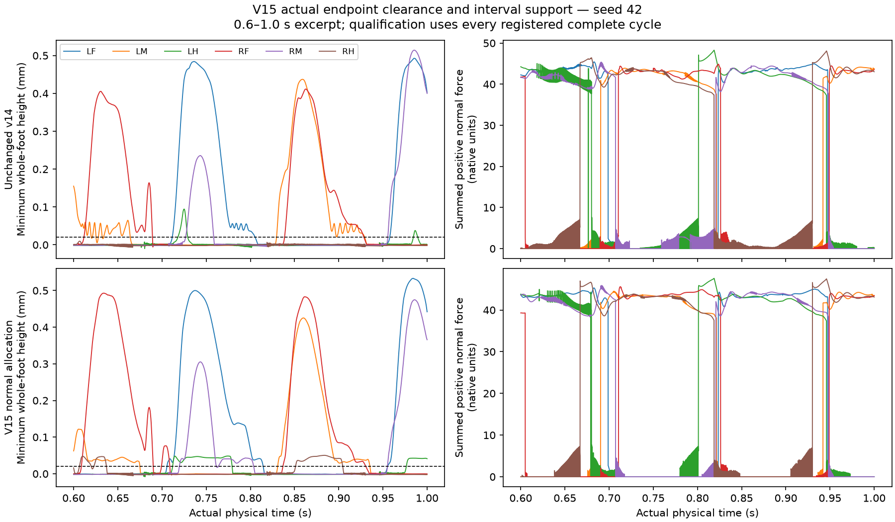

# V15 whole-foot retraction feedback mechanical experiment

Development candidate passed: **False**. Independent numerical verification passed: **True**.

One fixed engineered minimum-vertex normal retraction allocation replaces the v14 additive retraction vector only during strict updated swing. It uses a tangential-nullspace unit direction, tracking-aware .05 mm target, inherited angular budget and compiled limits. Retraction offset is zero in stance; native stumbling at zero retraction remains unchanged. Fresh unchanged v14 is the matched control. Plant, gains, phase/scalar dynamics, adhesion, subjects and all physical gates remain unchanged. This is a local linear engineering correction, not biological attribution; actual ALL-vertex clearance and contact-force dwell decide recovery.

| Profile | Seed | Case | Speed mm/s | Yaw rad | Recovery | Support/slip | Stop | Failed gates |
|---|---:|---|---:|---:|---|---|---|---|
| minimum-vertex-normal-retraction-v15 | 42 | straight-008 | 1.676153 | 0.056286 | True | True | True | none |
| minimum-vertex-normal-retraction-v15 | 42 | straight-02 | 4.623890 | 0.136608 | True | True | True | none |
| minimum-vertex-normal-retraction-v15 | 42 | straight-04 | 9.790422 | 0.516331 | False | True | True | recovery, straight_yaw |
| minimum-vertex-normal-retraction-v15 | 42 | turn-negative-04 | 4.561029 | -1.276628 | True | True | True | none |
| minimum-vertex-normal-retraction-v15 | 42 | turn-negative-08 | 4.803508 | -3.662496 | False | True | True | recovery |
| minimum-vertex-normal-retraction-v15 | 42 | turn-positive-04 | 4.635582 | 1.414190 | True | True | True | none |
| minimum-vertex-normal-retraction-v15 | 42 | turn-positive-08 | 5.247923 | 4.019672 | False | True | True | recovery |
| minimum-vertex-normal-retraction-v15 | 42 | zero | -0.000000 | -0.000000 | exempt | exempt | True | none |
| minimum-vertex-normal-retraction-v15 | 43 | straight-008 | 1.744238 | -0.027135 | True | True | True | none |
| minimum-vertex-normal-retraction-v15 | 43 | straight-02 | 4.656654 | 0.070394 | True | True | True | none |
| minimum-vertex-normal-retraction-v15 | 43 | straight-04 | 9.793791 | 0.071210 | False | True | True | recovery |
| minimum-vertex-normal-retraction-v15 | 43 | turn-negative-04 | 4.801172 | -1.358712 | True | True | True | none |
| minimum-vertex-normal-retraction-v15 | 43 | turn-negative-08 | 5.078575 | -3.735084 | False | True | True | recovery |
| minimum-vertex-normal-retraction-v15 | 43 | turn-positive-04 | 4.636243 | 1.398349 | False | True | True | recovery |
| minimum-vertex-normal-retraction-v15 | 43 | turn-positive-08 | 5.062341 | 3.842786 | False | True | True | recovery |
| minimum-vertex-normal-retraction-v15 | 43 | zero | 0.000000 | -0.000001 | exempt | exempt | True | none |
| whole-foot-retraction-feedback-v14 | 42 | straight-008 | 1.671427 | 0.211422 | False | True | True | recovery |
| whole-foot-retraction-feedback-v14 | 42 | straight-02 | 4.544402 | 0.171987 | False | True | True | recovery |
| whole-foot-retraction-feedback-v14 | 42 | straight-04 | 9.375098 | 0.203616 | False | True | True | recovery |
| whole-foot-retraction-feedback-v14 | 42 | turn-negative-04 | 4.380377 | -0.970100 | False | True | True | recovery |
| whole-foot-retraction-feedback-v14 | 42 | turn-negative-08 | 4.011417 | -2.774953 | False | True | True | recovery |
| whole-foot-retraction-feedback-v14 | 42 | turn-positive-04 | 4.490874 | 1.256450 | False | False | True | recovery, support_slip |
| whole-foot-retraction-feedback-v14 | 42 | turn-positive-08 | 4.519611 | 3.104263 | False | True | True | recovery |
| whole-foot-retraction-feedback-v14 | 42 | zero | -0.000000 | -0.000000 | exempt | exempt | True | none |
| whole-foot-retraction-feedback-v14 | 43 | straight-008 | 1.792833 | 0.002741 | False | False | True | recovery, support_slip |
| whole-foot-retraction-feedback-v14 | 43 | straight-02 | 4.534173 | 0.103297 | False | True | True | recovery |
| whole-foot-retraction-feedback-v14 | 43 | straight-04 | 9.498126 | -0.061418 | False | True | True | recovery |
| whole-foot-retraction-feedback-v14 | 43 | turn-negative-04 | 4.576074 | -1.051272 | False | True | True | recovery |
| whole-foot-retraction-feedback-v14 | 43 | turn-negative-08 | 4.329837 | -2.890948 | False | True | True | recovery |
| whole-foot-retraction-feedback-v14 | 43 | turn-positive-04 | 4.523230 | 1.063458 | False | True | True | recovery |
| whole-foot-retraction-feedback-v14 | 43 | turn-positive-08 | 4.379700 | 3.028882 | False | True | True | recovery |
| whole-foot-retraction-feedback-v14 | 43 | zero | 0.000000 | -0.000001 | exempt | exempt | True | none |

## Feedback and limits

Candidate trigger counts and raw retraction maxima by leg (LF, LM, LH, RF, RM, RH):

- minimum-vertex-normal-retraction-v15--42--straight-008: triggers [5037, 8023, 8296, 4266, 6466, 10036]; raw maxima [115.1999999999979, 216.0400000000154, 235.4200000000144, 111.61999999999796, 175.48000000000616, 223.33000000001354]; raw scalar >80 active ticks [1075, 6776, 11126, 928, 5123, 10488].
- minimum-vertex-normal-retraction-v15--42--straight-02: triggers [3500, 3476, 9276, 3573, 4213, 9427]; raw maxima [30.5599999999997, 75.60999999999852, 98.23999999999826, 40.63999999999949, 64.23999999999877, 91.29999999999824]; raw scalar >80 active ticks [0, 0, 1655, 0, 0, 1824].
- minimum-vertex-normal-retraction-v15--42--straight-04: triggers [4527, 3038, 9333, 4911, 4126, 9757]; raw maxima [18.819999999999947, 47.519999999999314, 53.27999999999922, 23.11999999999986, 27.379999999999757, 54.0799999999992]; raw scalar >80 active ticks [0, 0, 0, 0, 0, 0].
- minimum-vertex-normal-retraction-v15--42--turn-negative-04: triggers [1952, 2727, 9275, 6280, 6708, 9065]; raw maxima [33.31999999999956, 53.83999999999921, 92.65999999999836, 58.47999999999911, 72.10999999999864, 89.51999999999845]; raw scalar >80 active ticks [0, 0, 1747, 0, 0, 971].
- minimum-vertex-normal-retraction-v15--42--turn-negative-08: triggers [1669, 3985, 9659, 8162, 9382, 8468]; raw maxima [23.949999999999765, 50.79999999999927, 103.86999999999809, 83.39999999999839, 104.60000000000345, 79.78999999999856]; raw scalar >80 active ticks [0, 0, 2265, 91, 2717, 0].
- minimum-vertex-normal-retraction-v15--42--turn-positive-04: triggers [6086, 7590, 8792, 2127, 3367, 9455]; raw maxima [56.90999999999902, 91.41999999999837, 92.3699999999985, 41.99999999999946, 54.23999999999911, 99.64999999999812]; raw scalar >80 active ticks [0, 306, 941, 0, 0, 1795].
- minimum-vertex-normal-retraction-v15--42--turn-positive-08: triggers [7639, 8787, 8293, 2170, 4721, 9785]; raw maxima [77.26999999999846, 99.63000000000298, 79.63999999999855, 46.07999999999937, 59.569999999998856, 88.63999999999847]; raw scalar >80 active ticks [0, 2550, 0, 0, 0, 1274].
- minimum-vertex-normal-retraction-v15--42--zero: triggers [0, 0, 0, 0, 0, 0]; raw maxima [0.0, 0.0, 0.0, 0.0, 0.0, 0.0]; raw scalar >80 active ticks [0, 0, 0, 0, 0, 0].
- minimum-vertex-normal-retraction-v15--43--straight-008: triggers [5626, 5306, 9853, 5516, 6543, 9555]; raw maxima [140.48000000000107, 124.3199999999977, 219.4400000000119, 111.12999999999838, 201.9200000000082, 230.2400000000136]; raw scalar >80 active ticks [2613, 2077, 11792, 1575, 3877, 11998].
- minimum-vertex-normal-retraction-v15--43--straight-02: triggers [4038, 3558, 9272, 4264, 4095, 9812]; raw maxima [45.12999999999901, 54.63999999999901, 88.63999999999847, 51.35999999999926, 71.81999999999867, 94.23999999999835]; raw scalar >80 active ticks [0, 0, 1587, 0, 0, 1707].
- minimum-vertex-normal-retraction-v15--43--straight-04: triggers [4472, 3503, 9652, 4488, 3852, 9702]; raw maxima [31.059999999999587, 28.839999999999705, 46.23999999999937, 26.959999999999777, 38.00999999999953, 52.47999999999924]; raw scalar >80 active ticks [0, 0, 0, 0, 0, 0].
- minimum-vertex-normal-retraction-v15--43--turn-negative-04: triggers [2091, 1864, 9223, 7367, 6916, 9549]; raw maxima [45.399999999999, 40.319999999999496, 88.71999999999846, 56.609999999999026, 84.74999999999824, 91.19999999999841]; raw scalar >80 active ticks [0, 0, 1328, 0, 127, 997].
- minimum-vertex-normal-retraction-v15--43--turn-negative-08: triggers [1732, 3340, 9443, 9585, 9475, 8995]; raw maxima [47.909999999998966, 42.17999999999945, 88.87999999999846, 82.19999999999838, 107.17000000000412, 79.18999999999856]; raw scalar >80 active ticks [0, 0, 1822, 59, 3194, 0].
- minimum-vertex-normal-retraction-v15--43--turn-positive-04: triggers [7233, 7547, 9156, 2949, 2113, 9530]; raw maxima [71.46999999999863, 89.23999999999869, 88.63999999999847, 77.11999999999871, 53.27999999999922, 88.63999999999847]; raw scalar >80 active ticks [0, 332, 690, 0, 0, 1406].
- minimum-vertex-normal-retraction-v15--43--turn-positive-08: triggers [9309, 9825, 8803, 2253, 3264, 9594]; raw maxima [82.25999999999854, 111.81000000000822, 85.27999999999854, 56.719999999999146, 33.18999999999962, 88.63999999999847]; raw scalar >80 active ticks [61, 4460, 141, 0, 0, 1641].
- minimum-vertex-normal-retraction-v15--43--zero: triggers [0, 0, 0, 0, 0, 0]; raw maxima [0.0, 0.0, 0.0, 0.0, 0.0, 0.0]; raw scalar >80 active ticks [0, 0, 0, 0, 0, 0].

## Speed dose gates

- minimum-vertex-normal-retraction-v15--42--speed-dose: True
- minimum-vertex-normal-retraction-v15--43--speed-dose: True
- whole-foot-retraction-feedback-v14--42--speed-dose: True
- whole-foot-retraction-feedback-v14--43--speed-dose: True

## Evidence and limits

Actual physical seconds: 128.0. Full network seconds: 0. Peak RSS: 1647558656 bytes. Runtime: 3517.45 seconds.
Registration SHA-256: `84af8f9292b2841163b870ef7eb35d392f388495e490e66a5422ce4999802d49`.
Actual nonphysical tests: 36 passing cases; JUnit SHA-256 `49666df4598fe9837f41e596930f7743ef998a77648bcd973f788c6b9a28e477`.

Raw force/cache rows retain their prestate ownership; corrected endpoints use q[k], and every coherent contact velocity uses J(q[k-1])v[k-1]. Tick zero contributes no quadrature. Every complete swing/stance, ambiguity, reversal, tie, boundary partial, passive state and joint tracking measurement is retained.

Development failure blocks held-out, repeat, restoration, neural, phenotype and product admission. This experiment does not establish coordinated walking unless all frozen gates and later qualification pass. No coefficient was selected from its outcome.

Actual walking remains the first unresolved goal, followed by the unchanged original neural 15 predicates, matched Wild Type/official/user phenotype panels and causal ablations, then clear design identity and actual-state Lab/API/replay integration.

## Conditional qualification

- held-out: unrun; development did not admit continuation.
- exact repeat: unrun; development did not admit continuation.
- active restoration: unrun; development did not admit continuation.