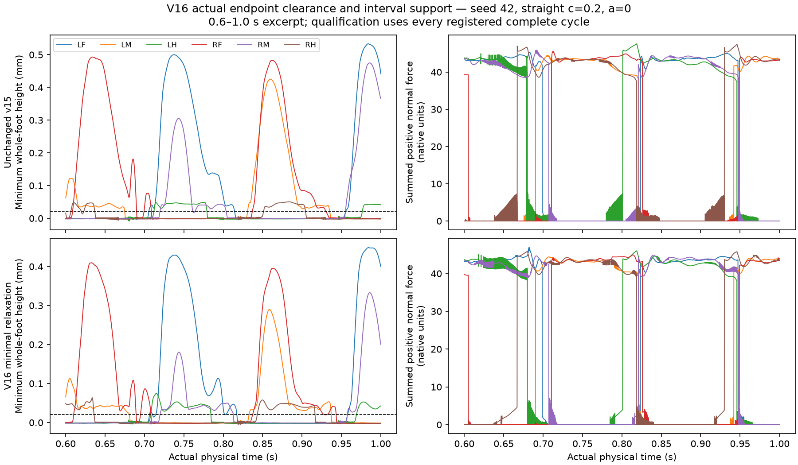

# V16 whole-foot retraction feedback mechanical experiment

Development candidate passed: **False**. Independent numerical verification passed: **True**.

One fixed engineered two-direction relaxation changes only the v15 budget-limited swing allocation. Already-feasible v15 allocation remains unchanged. The same instantaneous angular budget is retained, with the smallest row-space amplitude in the selected two-direction plane when feasible, and bounded maximum normal authority otherwise. This explicitly permits tangential motion; AP, yaw, ALL-vertex clearance, actual unloaded dwell, support and slip remain decisive. Fresh unchanged v15 is the control. Plant, gains, scalar/phase dynamics, adhesion, subjects and gates remain unchanged.

| Profile | Seed | Case | Speed mm/s | Yaw rad | Recovery | Support/slip | Stop | Failed gates |
|---|---:|---|---:|---:|---|---|---|---|
| budget-preserving-tangent-relaxation-v16 | 42 | straight-008 | 1.555987 | 0.029369 | True | True | True | none |
| budget-preserving-tangent-relaxation-v16 | 42 | straight-02 | 4.100033 | 0.092991 | True | True | True | none |
| budget-preserving-tangent-relaxation-v16 | 42 | straight-04 | 8.641163 | 0.150280 | False | True | True | recovery |
| budget-preserving-tangent-relaxation-v16 | 42 | turn-negative-04 | 3.966572 | -1.437233 | True | True | True | none |
| budget-preserving-tangent-relaxation-v16 | 42 | turn-negative-08 | 3.607700 | -3.065728 | True | True | True | none |
| budget-preserving-tangent-relaxation-v16 | 42 | turn-positive-04 | 4.028268 | 1.648423 | True | True | True | none |
| budget-preserving-tangent-relaxation-v16 | 42 | turn-positive-08 | 4.104827 | 3.322669 | False | True | True | recovery |
| budget-preserving-tangent-relaxation-v16 | 42 | zero | -0.000000 | -0.000000 | exempt | exempt | True | none |
| budget-preserving-tangent-relaxation-v16 | 43 | straight-008 | 0.248865 | 0.555317 | True | False | True | straight_yaw, support_slip, upright |
| budget-preserving-tangent-relaxation-v16 | 43 | straight-02 | 4.150494 | 0.063423 | True | False | True | support_slip |
| budget-preserving-tangent-relaxation-v16 | 43 | straight-04 | 8.744462 | -0.061382 | True | True | True | none |
| budget-preserving-tangent-relaxation-v16 | 43 | turn-negative-04 | 4.145018 | -1.580219 | True | True | True | none |
| budget-preserving-tangent-relaxation-v16 | 43 | turn-negative-08 | 3.898710 | -3.209527 | True | True | True | none |
| budget-preserving-tangent-relaxation-v16 | 43 | turn-positive-04 | 4.067404 | 1.552483 | True | False | True | support_slip |
| budget-preserving-tangent-relaxation-v16 | 43 | turn-positive-08 | 3.885606 | 3.236974 | True | True | True | none |
| budget-preserving-tangent-relaxation-v16 | 43 | zero | 0.000000 | -0.000001 | exempt | exempt | True | none |
| minimum-vertex-normal-retraction-v15 | 42 | straight-008 | 1.676153 | 0.056286 | True | True | True | none |
| minimum-vertex-normal-retraction-v15 | 42 | straight-02 | 4.623890 | 0.136608 | True | True | True | none |
| minimum-vertex-normal-retraction-v15 | 42 | straight-04 | 9.790422 | 0.516331 | False | True | True | recovery, straight_yaw |
| minimum-vertex-normal-retraction-v15 | 42 | turn-negative-04 | 4.561029 | -1.276628 | True | True | True | none |
| minimum-vertex-normal-retraction-v15 | 42 | turn-negative-08 | 4.803508 | -3.662496 | False | True | True | recovery |
| minimum-vertex-normal-retraction-v15 | 42 | turn-positive-04 | 4.635582 | 1.414190 | True | True | True | none |
| minimum-vertex-normal-retraction-v15 | 42 | turn-positive-08 | 5.247923 | 4.019672 | False | True | True | recovery |
| minimum-vertex-normal-retraction-v15 | 42 | zero | -0.000000 | -0.000000 | exempt | exempt | True | none |
| minimum-vertex-normal-retraction-v15 | 43 | straight-008 | 1.744238 | -0.027135 | True | True | True | none |
| minimum-vertex-normal-retraction-v15 | 43 | straight-02 | 4.656654 | 0.070394 | True | True | True | none |
| minimum-vertex-normal-retraction-v15 | 43 | straight-04 | 9.793791 | 0.071210 | False | True | True | recovery |
| minimum-vertex-normal-retraction-v15 | 43 | turn-negative-04 | 4.801172 | -1.358712 | True | True | True | none |
| minimum-vertex-normal-retraction-v15 | 43 | turn-negative-08 | 5.078575 | -3.735084 | False | True | True | recovery |
| minimum-vertex-normal-retraction-v15 | 43 | turn-positive-04 | 4.636243 | 1.398349 | False | True | True | recovery |
| minimum-vertex-normal-retraction-v15 | 43 | turn-positive-08 | 5.062341 | 3.842786 | False | True | True | recovery |
| minimum-vertex-normal-retraction-v15 | 43 | zero | 0.000000 | -0.000001 | exempt | exempt | True | none |

## Feedback and limits

Candidate trigger counts and raw retraction maxima by leg (LF, LM, LH, RF, RM, RH):

- budget-preserving-tangent-relaxation-v16--42--straight-008: triggers [5493, 8911, 8175, 5032, 7050, 9790]; raw maxima [112.39999999999796, 228.49000000001527, 232.12000000001385, 118.63999999999783, 176.08000000000598, 222.80000000001243]; raw scalar >80 active ticks [2212, 7455, 11137, 1035, 6401, 9484].
- budget-preserving-tangent-relaxation-v16--42--straight-02: triggers [3422, 5669, 8230, 3542, 5778, 8407]; raw maxima [46.119999999998925, 78.30999999999845, 77.83999999999845, 39.919999999999504, 63.43999999999882, 83.4299999999985]; raw scalar >80 active ticks [0, 0, 0, 0, 0, 91].
- budget-preserving-tangent-relaxation-v16--42--straight-04: triggers [2759, 5052, 8748, 2836, 5013, 9122]; raw maxima [18.979999999999873, 40.46999999999938, 50.579999999999245, 19.919999999999927, 29.479999999999713, 50.17999999999924]; raw scalar >80 active ticks [0, 0, 0, 0, 0, 0].
- budget-preserving-tangent-relaxation-v16--42--turn-negative-04: triggers [2082, 4763, 8365, 6134, 8153, 8221]; raw maxima [28.879999999999697, 58.90999999999889, 75.6699999999986, 61.19999999999905, 91.7599999999984, 87.25999999999834]; raw scalar >80 active ticks [0, 0, 0, 0, 330, 194].
- budget-preserving-tangent-relaxation-v16--42--turn-negative-08: triggers [1867, 4422, 8258, 7865, 8919, 8382]; raw maxima [16.88999999999995, 52.089999999999065, 72.66999999999838, 74.84999999999854, 92.21999999999909, 75.99999999999855]; raw scalar >80 active ticks [0, 0, 0, 0, 1044, 0].
- budget-preserving-tangent-relaxation-v16--42--turn-positive-04: triggers [6122, 8500, 7947, 2186, 5209, 8501]; raw maxima [56.63999999999915, 87.96999999999846, 84.95999999999849, 41.359999999999474, 67.28999999999874, 79.52999999999851]; raw scalar >80 active ticks [0, 213, 132, 0, 0, 0].
- budget-preserving-tangent-relaxation-v16--42--turn-positive-08: triggers [7567, 8257, 7981, 2414, 4947, 8629]; raw maxima [75.14999999999854, 88.47999999999834, 74.9899999999986, 43.28999999999939, 81.31999999999931, 73.11999999999865]; raw scalar >80 active ticks [0, 540, 0, 0, 35, 0].
- budget-preserving-tangent-relaxation-v16--42--zero: triggers [0, 0, 0, 0, 0, 0]; raw maxima [0.0, 0.0, 0.0, 0.0, 0.0, 0.0]; raw scalar >80 active ticks [0, 0, 0, 0, 0, 0].
- budget-preserving-tangent-relaxation-v16--43--straight-008: triggers [2050, 1940, 1758, 2081, 3416, 3100]; raw maxima [139.88000000000008, 114.93999999999734, 129.98999999999816, 103.47999999999881, 194.18000000000794, 239.01000000001497]; raw scalar >80 active ticks [1884, 966, 1369, 834, 3082, 4353].
- budget-preserving-tangent-relaxation-v16--43--straight-02: triggers [3884, 5567, 8467, 4171, 5720, 8909]; raw maxima [56.2299999999989, 65.97999999999881, 83.43999999999852, 51.35999999999926, 87.26999999999815, 93.93999999999835]; raw scalar >80 active ticks [0, 0, 92, 0, 194, 374].
- budget-preserving-tangent-relaxation-v16--43--straight-04: triggers [3009, 4780, 9009, 3167, 4994, 9085]; raw maxima [24.459999999999745, 27.639999999999734, 44.7999999999994, 29.019999999999722, 42.959999999999276, 46.85999999999933]; raw scalar >80 active ticks [0, 0, 0, 0, 0, 0].
- budget-preserving-tangent-relaxation-v16--43--turn-negative-04: triggers [2348, 4367, 8383, 7105, 8103, 8583]; raw maxima [52.74999999999893, 42.029999999999426, 75.81999999999859, 56.15999999999916, 77.34999999999846, 81.44999999999851]; raw scalar >80 active ticks [0, 0, 0, 0, 0, 39].
- budget-preserving-tangent-relaxation-v16--43--turn-negative-08: triggers [2030, 3992, 8188, 9429, 8999, 8866]; raw maxima [48.35999999999896, 42.04999999999945, 71.38999999999864, 77.13999999999848, 87.33999999999835, 74.9899999999986]; raw scalar >80 active ticks [0, 0, 0, 0, 508, 0].
- budget-preserving-tangent-relaxation-v16--43--turn-positive-04: triggers [7337, 8800, 8335, 3464, 4479, 8606]; raw maxima [71.91999999999862, 94.51999999999947, 77.86999999999858, 79.75999999999866, 54.399999999999196, 77.34999999999859]; raw scalar >80 active ticks [0, 789, 0, 0, 0, 0].
- budget-preserving-tangent-relaxation-v16--43--turn-positive-08: triggers [9142, 9335, 8499, 2482, 3636, 8249]; raw maxima [74.99999999999854, 92.82999999999836, 75.82999999999863, 56.719999999999146, 33.909999999999606, 71.68999999999863]; raw scalar >80 active ticks [0, 860, 0, 0, 0, 0].
- budget-preserving-tangent-relaxation-v16--43--zero: triggers [0, 0, 0, 0, 0, 0]; raw maxima [0.0, 0.0, 0.0, 0.0, 0.0, 0.0]; raw scalar >80 active ticks [0, 0, 0, 0, 0, 0].

## Registered relaxation diagnostics

- budget-preserving-tangent-relaxation-v16--42--straight-008: branch leg-rows unchanged/relaxed/maximum-authority [118492, 4291, 9217]; maximum row-space amplitude (rad) [0.2170174181147014, 0.17892287922211483, 0.27029994893721354, 0.26119938075037064, 0.2557212657838764, 0.2822582157104124]; positive local residual rows [2800, 5759, 3307, 2409, 4464, 4894]. Branch zero includes inactive/stance zero diagnostics; local residual is not a physical admission gate.
- budget-preserving-tangent-relaxation-v16--42--straight-02: branch leg-rows unchanged/relaxed/maximum-authority [108319, 11226, 12455]; maximum row-space amplitude (rad) [0.09545920283876673, 0.19919068900251, 0.2763834367422663, 0.242203532043107, 0.18246589436993949, 0.3428959710578734]; positive local residual rows [2390, 3005, 6496, 2572, 2994, 6462]. Branch zero includes inactive/stance zero diagnostics; local residual is not a physical admission gate.
- budget-preserving-tangent-relaxation-v16--42--straight-04: branch leg-rows unchanged/relaxed/maximum-authority [100394, 11471, 20135]; maximum row-space amplitude (rad) [0.11604500316383029, 0.20779156642366828, 0.3343744758668517, 0.1419726408830039, 0.16610866465155258, 0.3312552737385937]; positive local residual rows [2196, 3377, 7233, 2332, 3374, 7513]. Branch zero includes inactive/stance zero diagnostics; local residual is not a physical admission gate.
- budget-preserving-tangent-relaxation-v16--42--turn-negative-04: branch leg-rows unchanged/relaxed/maximum-authority [109040, 11359, 11601]; maximum row-space amplitude (rad) [0.1347324771864382, 0.22335513960760658, 0.3011387530910842, 0.21073131493033564, 0.15848569225590126, 0.25867679311719444]; positive local residual rows [1531, 2103, 5804, 4459, 5651, 7247]. Branch zero includes inactive/stance zero diagnostics; local residual is not a physical admission gate.
- budget-preserving-tangent-relaxation-v16--42--turn-negative-08: branch leg-rows unchanged/relaxed/maximum-authority [106687, 11690, 13623]; maximum row-space amplitude (rad) [0.16335686095118113, 0.25071733747074265, 0.44495110343533884, 0.2964884031128514, 0.20742795835460867, 0.2549780796357243]; positive local residual rows [1471, 3290, 6957, 6873, 8808, 7992]. Branch zero includes inactive/stance zero diagnostics; local residual is not a physical admission gate.
- budget-preserving-tangent-relaxation-v16--42--turn-positive-04: branch leg-rows unchanged/relaxed/maximum-authority [108734, 10631, 12635]; maximum row-space amplitude (rad) [0.21639593502398982, 0.25693830326378375, 0.3180808648987031, 0.2542833800529496, 0.2059166910909606, 0.39093153205510406]; positive local residual rows [4122, 6151, 7231, 1684, 2540, 6344]. Branch zero includes inactive/stance zero diagnostics; local residual is not a physical admission gate.
- budget-preserving-tangent-relaxation-v16--42--turn-positive-08: branch leg-rows unchanged/relaxed/maximum-authority [106239, 11045, 14716]; maximum row-space amplitude (rad) [0.28342208078836806, 0.21308614002123322, 0.23623915542431512, 0.262848957747001, 0.19738822014086158, 0.5208583982139869]; positive local residual rows [6464, 7819, 7876, 1912, 3328, 7327]. Branch zero includes inactive/stance zero diagnostics; local residual is not a physical admission gate.
- budget-preserving-tangent-relaxation-v16--42--zero: branch leg-rows unchanged/relaxed/maximum-authority [132000, 0, 0]; maximum row-space amplitude (rad) [0.0, 0.0, 0.0, 0.0, 0.0, 0.0]; positive local residual rows [0, 0, 0, 0, 0, 0]. Branch zero includes inactive/stance zero diagnostics; local residual is not a physical admission gate.
- budget-preserving-tangent-relaxation-v16--43--straight-008: branch leg-rows unchanged/relaxed/maximum-authority [127560, 1501, 2939]; maximum row-space amplitude (rad) [0.2209187870658992, 0.10630794813028181, 0.23567669180570128, 0.23955940943809917, 0.22392606711895038, 0.24181080671368962]; positive local residual rows [2008, 1323, 1528, 1046, 1813, 1346]. Branch zero includes inactive/stance zero diagnostics; local residual is not a physical admission gate.
- budget-preserving-tangent-relaxation-v16--43--straight-02: branch leg-rows unchanged/relaxed/maximum-authority [108465, 10706, 12829]; maximum row-space amplitude (rad) [0.23150090149784483, 0.1214033996796714, 0.27420520438931684, 0.3301021448003601, 0.19618573468689707, 0.2786452604069919]; positive local residual rows [2779, 3073, 5941, 3070, 3134, 6303]. Branch zero includes inactive/stance zero diagnostics; local residual is not a physical admission gate.
- budget-preserving-tangent-relaxation-v16--43--straight-04: branch leg-rows unchanged/relaxed/maximum-authority [99784, 12030, 20186]; maximum row-space amplitude (rad) [0.23718456074808067, 0.1333815790979032, 0.32288793213907, 0.25777404857499414, 0.2120560426953336, 0.33409311819071125]; positive local residual rows [2501, 3200, 7353, 2616, 3421, 7337]. Branch zero includes inactive/stance zero diagnostics; local residual is not a physical admission gate.
- budget-preserving-tangent-relaxation-v16--43--turn-negative-04: branch leg-rows unchanged/relaxed/maximum-authority [108396, 11644, 11960]; maximum row-space amplitude (rad) [0.23801612139292738, 0.11368585456901907, 0.29333643229506934, 0.33019951053063634, 0.1979579329025456, 0.2524173283579263]; positive local residual rows [1820, 1996, 5948, 5180, 5641, 7694]. Branch zero includes inactive/stance zero diagnostics; local residual is not a physical admission gate.
- budget-preserving-tangent-relaxation-v16--43--turn-negative-08: branch leg-rows unchanged/relaxed/maximum-authority [107798, 10549, 13653]; maximum row-space amplitude (rad) [0.22264437881437302, 0.13237673627781435, 0.4104653041825392, 0.32593981007026074, 0.26095176343888377, 0.22409684130393095]; positive local residual rows [1638, 2907, 6719, 8384, 8814, 8449]. Branch zero includes inactive/stance zero diagnostics; local residual is not a physical admission gate.
- budget-preserving-tangent-relaxation-v16--43--turn-positive-04: branch leg-rows unchanged/relaxed/maximum-authority [108228, 11094, 12678]; maximum row-space amplitude (rad) [0.2987824603719946, 0.14024141327807774, 0.22737204232239122, 0.32661743358129586, 0.20087780406857136, 0.343264208743021]; positive local residual rows [5190, 6213, 7397, 2493, 2361, 6043]. Branch zero includes inactive/stance zero diagnostics; local residual is not a physical admission gate.
- budget-preserving-tangent-relaxation-v16--43--turn-positive-08: branch leg-rows unchanged/relaxed/maximum-authority [106859, 11274, 13867]; maximum row-space amplitude (rad) [0.28854342037316943, 0.21229420233059154, 0.228240949376624, 0.33543927191132394, 0.08595262325199617, 0.4119399325332926]; positive local residual rows [7482, 9076, 8228, 2016, 2720, 6673]. Branch zero includes inactive/stance zero diagnostics; local residual is not a physical admission gate.
- budget-preserving-tangent-relaxation-v16--43--zero: branch leg-rows unchanged/relaxed/maximum-authority [132000, 0, 0]; maximum row-space amplitude (rad) [0.0, 0.0, 0.0, 0.0, 0.0, 0.0]; positive local residual rows [0, 0, 0, 0, 0, 0]. Branch zero includes inactive/stance zero diagnostics; local residual is not a physical admission gate.

## Speed dose gates

- budget-preserving-tangent-relaxation-v16--42--speed-dose: True
- budget-preserving-tangent-relaxation-v16--43--speed-dose: True
- minimum-vertex-normal-retraction-v15--42--speed-dose: True
- minimum-vertex-normal-retraction-v15--43--speed-dose: True

## Evidence and limits

Actual physical seconds: 128.0. Full network seconds: 0. Peak RSS: 1461256192 bytes. Runtime: 3670.52 seconds.
Registration SHA-256: `ab7cc4d82e091f640d0a550e6569f894c5deac8e91673f00bdf008c37a06f26c`.
Actual nonphysical tests: 46 passing cases; JUnit SHA-256 `f13d38aed72323c32cd69efa95318185df78b4014897386cb996870f22b35d08`.

Raw force/cache rows retain their prestate ownership; corrected endpoints use q[k], and every coherent contact velocity uses J(q[k-1])v[k-1]. Tick zero contributes no quadrature. Every complete swing/stance, ambiguity, reversal, tie, boundary partial, passive state and joint tracking measurement is retained.

Development failure blocks held-out, repeat, restoration, neural, phenotype and product admission. This experiment does not establish coordinated walking unless all frozen gates and later qualification pass. No coefficient was selected from its outcome.

Actual walking remains the first unresolved goal, followed by the unchanged original neural 15 predicates, matched Wild Type/official/user phenotype panels and causal ablations, then clear design identity and actual-state Lab/API/replay integration.

## Conditional qualification

- held-out: unrun; development did not admit continuation.
- exact repeat: unrun; development did not admit continuation.
- active restoration: unrun; development did not admit continuation.