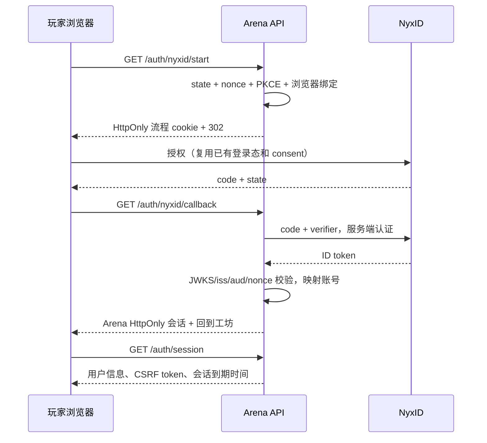

# NyxID 登录接口与后续对接说明

NyxID 使用服务端 OIDC 回调和 HttpOnly 会话。默认关闭，通过下述环境变量启用。

客户端换码优先使用 discovery 声明的 `client_secret_post`；仅声明 `client_secret_basic` 的 provider 使用 Basic。2026-09-24 真实联调发现 NyxID 同时声明两者，但 authorization-code 实现从表单读取凭据，Basic 请求会返回 `Missing client_id parameter`。两种发送方式互斥，secret 始终只通过服务端 HTTPS 发送。

## 无需 DNS 管理权限的试玩部署

GitHub Pages 可以作为入口，但不能处理 OAuth 服务端回调。没有域名管理权限时，将完整前端和 API 一起放在服务器现有的 HTTPS 地址：

1. 在 NyxID 应用中登记 **服务器 HTTPS 地址** 加 `/api/v1/auth/nyxid/callback`，`ARENA_PUBLIC_ORIGIN` 设为该地址。
2. 服务器启用 NyxID，并移除 `ARENA_WEB_ORIGIN`；网页和 API 同源，会话无需跨站 cookie。
3. GitHub Actions 仓库变量 `ARENA_APP_ORIGIN` 设为服务器 HTTPS origin，运行 `pages.yml`。Pages 会进入完整应用，保留比赛回放的 hash 链接，不转发查询参数或凭据。页面同时提供手动进入链接。

清空 `ARENA_APP_ORIGIN` 后重新部署，Pages 恢复独立前端模式；该模式仅支持现有的本地 bearer 身份，不能承载 NyxID cookie 登录。回滚时也应恢复后端认证模式。

Cloudflare quick tunnel 可用于这类试玩，但地址在隧道重建后可能变化。届时必须同步更新 NyxID 回调、服务器 origin 和 Pages 仓库变量。正式发布应使用可管理的稳定域名或托管平台的固定 HTTPS 地址。这里只依赖现有隧道，不需要 Cloudflare 域名账号。

## 用户体验

用户点击「通过 NyxID 登录」，首次在 NyxID 确认 `openid profile` 身份权限，回到 Arena 后自动建立会话。已有 NyxID 登录态和相同授权范围的用户，NyxID 现有实现会跳过重复授权。Arena 不发送强制 `prompt=consent` 或 `prompt=login`。

Arena 的 HttpOnly 会话默认有效 30 天，刷新和重新打开网页通过 `/auth/session` 自动恢复。在有效期内不重复跳转 NyxID。过期后重新走一次 OIDC；NyxID 是否要求重新输入账号，取决于它自己的登录态、MFA 和授权策略。“一次授权”不表示永久会话；上游撤销与 Arena 会话之间的同步边界见下方运维说明。

登录前未保存的 FlySpec 暂存在当前标签页的 sessionStorage，成功或取消授权返回后均恢复设计；不会自动发布或扣除比赛配额。首次新用户能否直接使用社交账号注册，取决于 NyxID 的邀请码策略。Arena 不增加第二套注册表单。

## 调研结论及源代码依据

调研对象为本地 NyxID checkout `96bfadf48e2140e27a081c834402164c8d2c0bd5`，未声称已验证生产实例行为。

- [OIDC discovery 实现](https://github.com/ChronoAIProject/NyxID/blob/96bfadf48e2140e27a081c834402164c8d2c0bd5/backend/src/handlers/oidc_discovery.rs)：支持 authorization code、PKCE S256、RS256 ID token、JWKS、`client_secret_basic`；`issuer` 来自独立的 `jwt_issuer`，端点 URL 来自 `base_url`。
- [授权与已有 consent 复用](https://github.com/ChronoAIProject/NyxID/blob/96bfadf48e2140e27a081c834402164c8d2c0bd5/backend/src/handlers/oauth.rs)：浏览器模式认证成功后，检查同用户/client/scope 的 consent；已有授权且未强制 consent 时直接签发 code。
- [Token 签发](https://github.com/ChronoAIProject/NyxID/blob/96bfadf48e2140e27a081c834402164c8d2c0bd5/backend/src/services/oauth_service.rs)：openid scope 才返回 ID token，并传递授权时的 nonce。
- [React SDK](https://github.com/ChronoAIProject/NyxID/blob/96bfadf48e2140e27a081c834402164c8d2c0bd5/sdk/oauth-react/README.md) 提供直接 SPA 集成。Arena 选择服务端回调，因为已有 FastAPI，浏览器只需一个会话 cookie，平台凭据处理可以集中在服务端。

注意：NyxID 文档有把 issuer URL 与 BASE_URL 视作同一入口的简化描述；实现允许二者不同，因此本适配器明确分开配置 discovery base URL 和预期 issuer。



## 接口契约

以下路径均以 `/api/v1` 为前缀。

| 方法与路径 | 契约 |
|---|---|
| `GET /auth/config` | 当前 mode、NyxID 是否启用、登录入口、本地注册是否可用；无密钥 |
| `GET /auth/nyxid/start` | 创建 10 分钟单次登录流程，302 到 discovery 给出的授权端点；未配置返回 503 |
| `GET /auth/nyxid/callback?code=…&state=…` | 单次消费浏览器绑定的 state，服务端换码与验签；成功 303 `/`，失败 303 `/?auth_error=sign_in_failed` |
| `GET /auth/session` | `{authenticated,user,csrf_token,expires_at}`；未登录也返回 200；所有认证响应 no-store |
| `GET /me` | 当前 Arena 身份；网页 cookie 与 Arena agent bearer 进入同一业务身份路径 |
| `POST /auth/logout` | 撤销当前 Arena 浏览器会话并清除 cookie；不退出其它 NyxID 应用 |
| `POST /auth/agent-tokens` | 已登录网页会话创建独立 30 天 Arena token，只返回一次；每人最多 10 个有效 token |
| `GET /auth/agent-tokens` | 当前用户有效 token 的 ID、创建/到期时间，不返回 token 或 hash |
| `DELETE /auth/agent-tokens/{id}` | 仅能撤销自己的 token，立即生效 |

使用 cookie 的写请求必须带 `Origin: <ARENA_PUBLIC_ORIGIN>` 和 `X-Arena-CSRF: <session.csrf_token>`。前端请求模块已自动添加 CSRF。程序化 agent 使用 `Authorization: Bearer <Arena token>`，无需浏览器 cookie/CSRF。NyxID 原始 access token、ID token 或其它 audience 的 JWT 不能直接调用 Arena 写接口。

账号主键映射为 `(issuer, sub) → Arena owner_id`，并使用事务防止重复创建。显示名称和 email 不参与自动合并。启用 NyxID 模式后，匿名本地注册及历史本地 bearer 登录会关闭，防止绕过 NyxID。历史果蝇与比赛记录保留；如果要把旧本地身份迁移给正式用户，须后续显式验证双方身份后迁移，不能按同名/email 猜测。

## 你之后需要配置的内容

在 NyxID 注册一个 **confidential web client**，支持 `authorization_code`、PKCE S256 和 `client_secret_post`，授权范围 `openid profile`。注册准确回调 URI：

```text
https://<Arena 域名>/api/v1/auth/nyxid/callback
```

本地开发可在 NyxID 单独登记 `http://127.0.0.1:8080/api/v1/auth/nyxid/callback`。浏览器的 Arena origin 必须与配置完全一致；不要交替使用 localhost 与 127.0.0.1。

配置项模板在 [../.env.example](../.env.example)：

| 变量 | 作用 |
|---|---|
| `ARENA_AUTH_MODE` | 默认 `local`；正式连接后改为 `nyxid` |
| `ARENA_NYXID_BASE_URL` | 用于读取 `/.well-known/openid-configuration` 的 HTTPS 基地址 |
| `ARENA_NYXID_ISSUER` | discovery 和 ID token 中必须精确匹配的 issuer |
| `ARENA_NYXID_CLIENT_ID` | 你登记的客户端 ID |
| `ARENA_NYXID_CLIENT_SECRET` | 只在服务端环境提供 |
| `ARENA_PUBLIC_ORIGIN` | 浏览器访问 Arena 的 origin，不含路径或查询参数 |

Arena 不会自动读取 `.env`；由实际进程环境注入。当前 launchd 安装脚本也不会自动传递这些配置，后续接入时需在对应服务环境显式配置后重启。缺少必需配置时，`nyxid` 模式启动失败，不会静默降级成本地注册。

真实 client secret 只保存在服务器私有配置中，不进入 GitHub、前端构建或日志。下述自动化测试使用临时 RSA 密钥和 `httpx.MockTransport`，不请求真实 NyxID；实际部署还需验证真实 provider 换码及网页会话。

## 会话与运维边界

- 浏览器会话 cookie：HttpOnly、SameSite=Lax、生产 HTTPS 下 Secure、`__Host-` 前缀及 host-only；数据库只存 token hash。认证 code 不进入应用存储，access/refresh/ID token 在校验后丢弃，不进入 localStorage。
- `state`、nonce、PKCE verifier 与独立浏览器 cookie 绑定；过期或已消费的回调不能建立新会话。callback 不接受外部 return_to，防止开放重定向。
- Arena 保持自己的 30 天会话，因此不需要在前端续签 NyxID token。NyxID 侧撤销 consent/封禁账号**不会即时终止已经建立的 Arena 会话**；后续真实接入时需决定撤销事件或周期性上游校验策略。当前退出 Arena 或本地会话到期立即停止 cookie 访问。
- Agent token 是 Arena 领域 token，权限覆盖当前设计/比赛 API，配额仍按 owner 计算；不会授予 NyxID 凭据代理、SSH 或管理权限。细分 scope、团队权限和 Ornn 委托属于后续接入。
- CLI 的 Uvicorn access log 关闭，避免回调查询串中的 authorization code 进入访问日志。后续反向代理同样应去除认证回调查询串，且不要记录 Cookie/Authorization 请求头。
- 新增 auth 表与模拟核心分离；没有改变神经、物理和裁判规则。依赖锁新增 JWT 验签依赖会改变 runtime lock hash，部署前仍需排空旧队列。

## 验证方法

```sh
uv run pytest tests/test_auth.py -q
uv run pytest -q
npm run build --prefix web
```

测试覆盖真实 RSA 验签、PKCE 换码参数、浏览器绑定、nonce/issuer/audience/过期/signature/azp/at_hash 拒绝、回调重放、跨进程会话恢复、同 issuer/sub 身份复用、同名/email 不误合并、CSRF、两种认证进入同一比赛 owner 路径、退出、到期、撤销与跨用户 token 隔离，以及未配置时保留本地 MVP。

这些证明接口可用且错误路径受控；**不证明你的生产 NyxID 已完成联调**。后续需实际验证首次同意、再次登录免重复同意、已有 NyxID 会话、新用户邀请码、失效/撤销，以及最终部署 origin/cookie 行为。
